## ⭐ organization structure 

The organizational structure in SAP MM (Materials Management) defines how a company is structured for procurement, inventory management, and material planning. It consists of different organizational units

| **Level** | **Description** |
|-----------|---------------|
| **Client** | Highest-level organization, representing a corporate group. |
| **Company Code (CC)** | Legal entity for financial reporting (FI module). |
| **Plant** | Physical location for production, storage, or distribution. |
| **Storage Location (SLoc)** | Subdivision of a plant for material storage. |
| **Purchasing Organization (POrg)** | Responsible for procurement activities. |
| **Purchasing Group (PGrp)** | Group of buyers responsible for procurement. |

---

**client** 

* data  in client may not accessed by another client

* client refers to single group of company

**company code**

* organization unit within the client

* where financial entries are produced 
* Producing its own balance sheets and Profit/loss statements
* Several company codes can be set up within the client
* Company code is defined as 4-digit Alpha numeric key ( e.g. SAP1)

**plant** 

* Is an operating unit, within a Company
Code, mostly defined for Production Center
or Material Requirements Planning or
simply a grouping of several Storage
Locations.

* Is assigned to a company code; many
plants can be assigned to one company
code.

* Is a place where either materials are
produced or goods/services are handled.

* it has own material master data

**Purchasing organization** 

* A purchasing organization is an organization unit which
is responsible for procuring material/Service

* The way in which purchasing organization is assigned to
company codes and plants will determine the
procurement method.

* Purchasing organization can be assigned to either
Company code or Plant based on the business
requirement

**What is a Reference Purchasing Organization?**

A Reference Purchasing Organization is a special type of purchasing organization in SAP MM that allows companies to centralize contract negotiations while enabling multiple purchasing organizations to use the same contract terms for procurement.

**storage location** 

* A storage location is an organizational unit
and Subdivision of a plant.

* Storage location defines a location for
materials.

* Stocks of material can be managed within a
plant in different storage locations for
differentiation

* Storage Location is the lowest organizational
level in MM and it helps to differentiate the
stocks.

* stocks of the material are physcially managed 

* stocks are managed at storage location in quantity level only, not an value basis

* storage location always belongs to plants 

* 4 digit alphanumberic key 

**purchasing group** 

* A purchasing group is an organization unit which is
responsible for procuring a class of materials for internal
units.

* **Responsible for certain type of material or service
procurement**

* Deals with the vendor by monitoring the purchasing
activities

* It is defined as 3 - digit alpha numeric key in the system.

* purchasing group is not directly assigned to purchasing organization

* purchasing group assigned to a maetrial in material master 

Here are **50 SAP MM Organizational Structure questions with answers** categorized into **Easy, Medium, and Hard** levels.

---

**🟢 EASY LEVEL (1-20)**  
1. **What is a Client in SAP MM?**  
   - The **Client** is the highest level in the SAP hierarchy and represents an independent unit with its own data and configuration.

2. **What is the purpose of a Company Code in SAP MM?**  
   - A **Company Code** is the smallest legal entity in SAP FI (Finance) for which financial statements are prepared.

3. **What is a Plant in SAP MM?**  
   - A **Plant** is an organizational unit that represents a manufacturing location, distribution center, or warehouse.

4. **What is a Storage Location used for?**  
   - A **Storage Location** is a subdivision of a Plant where materials are stored.

5. **What is the role of a Purchasing Organization?**  
   - A **Purchasing Organization** is responsible for procurement activities and contract negotiations.

6. **What is a Purchasing Group in SAP MM?**  
   - A **Purchasing Group** represents the buyers responsible for procurement transactions.

7. **Can multiple Plants be assigned to a single Company Code?**  
   - **Yes**, multiple Plants can be assigned to a single Company Code.

8. **How do you define a Plant in SAP MM? (T-Code)**  
   - T-Code: **OX10**

9. **What T-Code is used to assign a Plant to a Company Code?**  
   - T-Code: **OX18**

10. **Can a single Purchasing Organization serve multiple Company Codes?**  
   - **Yes**, if it is a **Cross-Company Code Purchasing Organization**.

11. **What is the highest level in the SAP MM Organizational Structure?**  
   - **Client**

12. **What is the transaction code to define a Storage Location?**  
   - T-Code: **OMMM**

13. **How many Purchasing Groups can be assigned to a Purchasing Organization?**  
   - **Multiple** Purchasing Groups can be assigned.

14. **Can a Plant exist without being assigned to a Company Code?**  
   - **No**, every Plant must be assigned to a Company Code.

15. **What T-Code is used to assign a Purchasing Organization to a Plant?**  
   - T-Code: **OX17**

16. **Can a Storage Location be assigned to multiple Plants?**  
   - **No**, a Storage Location is Plant-specific.

17. **What is the purpose of a Reference Purchasing Organization?**  
   - A **Reference Purchasing Organization** is used for **central contract negotiations** while multiple Purchasing Organizations use the contracts.

18. **What is the transaction code for editing a Plant in SAP MM?**  
   - T-Code: **OX10**

19. **What T-Code is used to create a Purchasing Organization?**  
   - T-Code: **OX08**

20. **What is the default factory calendar assigned at the Plant level?**  
   - The default **Factory Calendar** depends on country-specific working days.

---

 **🟡 MEDIUM LEVEL (21-40)**  

21. **Explain the relationship between Plant and Company Code.**  
   - A **Company Code** can have **multiple Plants**, but a **Plant belongs to only one Company Code**.

22. **Can multiple Storage Locations be assigned to a single Plant?**  
   - **Yes**, multiple Storage Locations can be assigned.

23. **What is the difference between a Standard Purchasing Organization and a Reference Purchasing Organization?**  
   - A **Standard POrg** handles procurement, while a **Reference POrg** only negotiates contracts.

24. **How does a Centralized Purchasing Organization work?**  
   - A single **Purchasing Organization** handles procurement for multiple Company Codes.

25. **Can a Purchasing Organization be assigned to multiple Plants?**  
   - **Yes**, a **Purchasing Organization** can serve multiple Plants.

26. **What is the purpose of a Cross-Company Code Purchasing Organization?**  
   - It allows a **Purchasing Organization** to manage procurement across **multiple Company Codes**.

27. **What are the main data fields required when defining a Plant in SAP MM?**  
   - Plant Name, Address, Factory Calendar, Region, Country Code.

28. **What is the impact of changing the Company Code assignment of a Plant?**  
   - It can impact **accounting, procurement, and inventory management**.

29. **Can a Storage Location exist without a Plant?**  
   - **No**, every Storage Location must belong to a Plant.

30. **How is a Plant linked to Material Master data?**  
   - Through **Plant-Specific Views** in the Material Master.

31. **What are the key tables storing Organizational Structure data in SAP MM?**  
   - **T001W** (Plants), **T024E** (Purchasing Organizations), **T001K** (Company Codes).

32. **How does a Purchasing Organization influence procurement processes?**  
   - It defines **vendor selection, contract terms, and purchasing conditions**.

33. **What happens if a Purchasing Organization is not assigned to a Plant?**  
   - Procurement cannot be carried out at that Plant.

34. **What are the limitations of a Reference Purchasing Organization?**  
   - It cannot directly create Purchase Orders.

35. **How can you check the assignment of a Plant to a Company Code?**  
   - Using T-Code **OX18**.

36. **What is the role of a Factory Calendar in a Plant?**  
   - It defines **working days and holidays** for material planning.

37. **How do you transfer materials between two Storage Locations within the same Plant?**  
   - Using a **Transfer Posting (T-Code: MIGO / MB1B)**.

38. **What is the difference between a Plant-specific POrg and a Company-specific POrg?**  
   - A **Plant-specific POrg** is limited to a Plant, while a **Company-specific POrg** covers multiple Plants in a Company Code.

39. **How do you configure a new Plant in SAP MM?**  
   - Using **OX10** → Assign it to a Company Code in **OX18**.

40. **How does the organizational structure impact the procurement process?**  
   - It defines **who procures, where goods are stored, and how invoices are processed**.

---

 **🔴 HARD LEVEL (41-50)**  

41. **How do you change a Plant assignment without affecting open Purchase Orders?**  
   - Ensure **Purchase Orders are completed or reassigned** before making changes in **OX18**.

42. **Explain how a Cross-Company Code Purchasing Organization affects financial transactions.**  
   - It enables **inter-company procurement** while managing costs at different levels.

43. **What are the real-time scenarios where a Reference Purchasing Organization is useful?**  
   - In **global procurement**, where contracts are negotiated centrally but executed locally.

44. **How can you set up a Global Purchasing Organization for multiple Company Codes?**  
   - Create a **Cross-Company Code POrg** and assign it to multiple Company Codes.

45. **Explain the dependencies between a Plant and a Storage Location in Inventory Management.**  
   - **Storage Locations** are specific to a **Plant**, affecting inventory tracking.

46. **How does the organizational structure in SAP MM integrate with SAP SD and SAP FI?**  
   - **MM → FI**: Stock valuation  
   - **MM → SD**: Stock availability for sales  

47. **How would you approach merging two Plants under one Company Code?**  
   - Transfer materials, update master data, and reassign configurations.

48. **What is the impact of deleting a Storage Location in SAP MM?**  
   - It affects **stock availability and historical transactions**.

49. **What is the relationship between Company Code, Controlling Area, and Plant in SAP?**  
   - A **Company Code** belongs to a **Controlling Area**, and **Plants belong to a Company Code**.

50. **What are the challenges in configuring a new organizational structure in SAP MM for a multinational company?**  
   - Legal compliance, multi-currency handling, and logistics complexity.

---

## ⭐ procurement cycle 

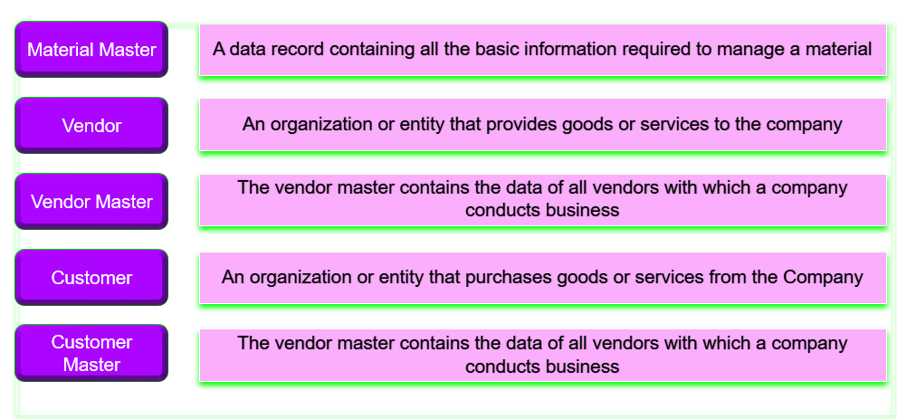
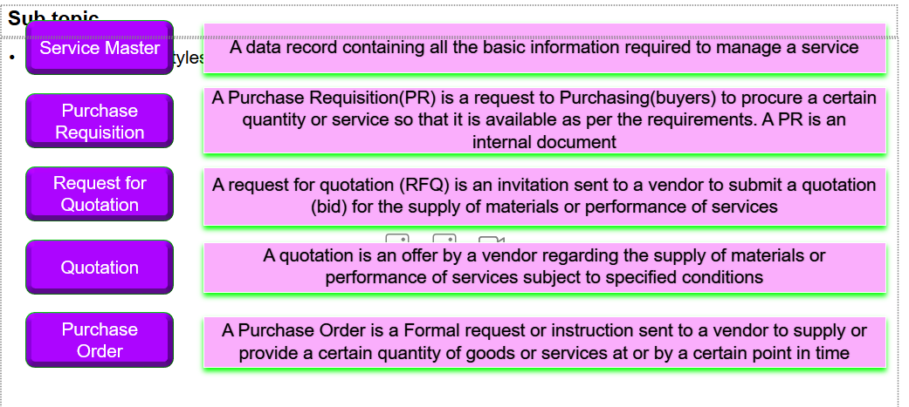
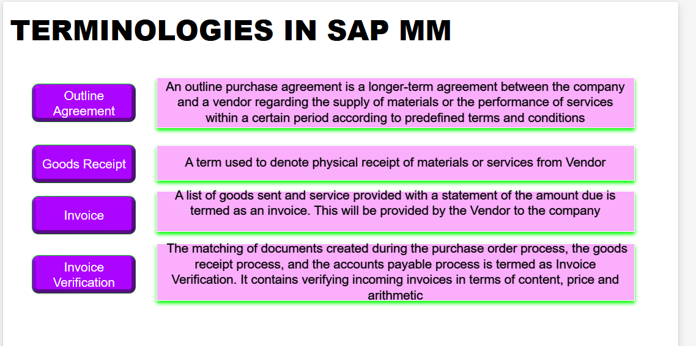
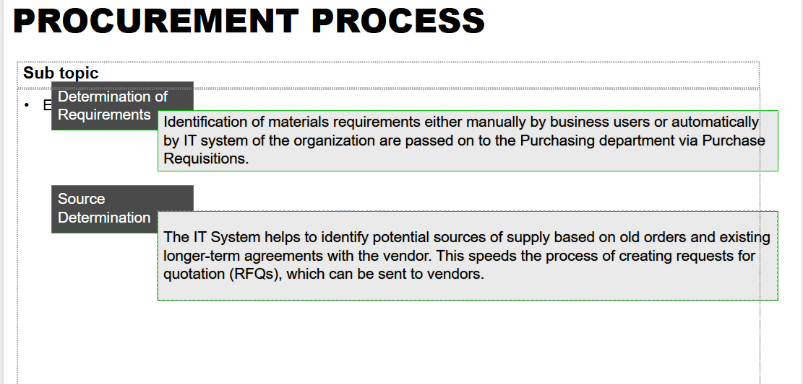
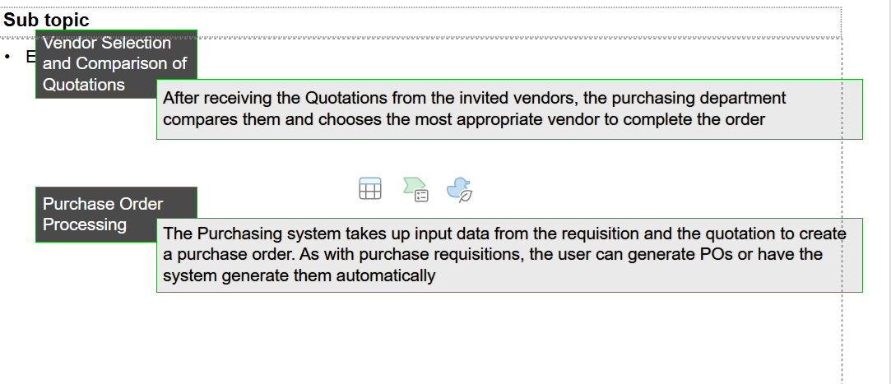
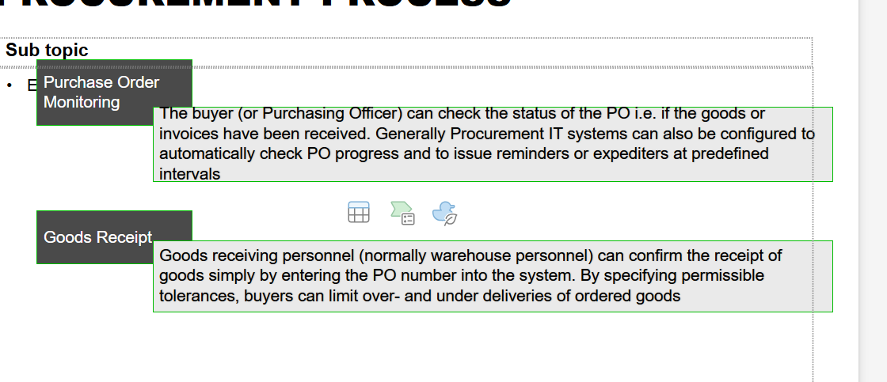
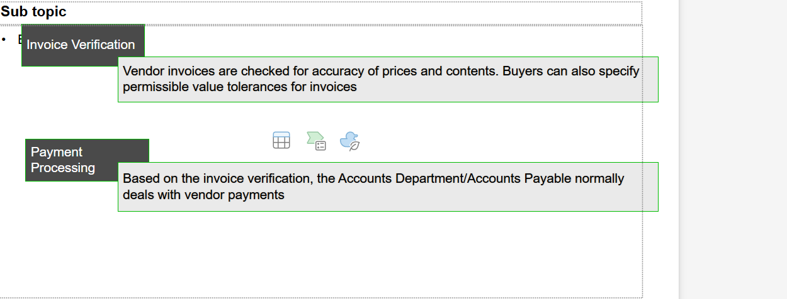

⭐ **types of procurement** 

* internal 

* external 

---

 **1️⃣ External Procurement**

**External Procurement** involves acquiring goods or services from external vendors or suppliers outside the organization. This is the most common method of procurement and includes the process of sourcing, purchasing, and receiving materials from external sources.

**Key Points in External Procurement**:
- **Source of Supply**: The materials are obtained from third-party vendors or suppliers.
- **Stock Procurement**: The goods are bought and stored in the company's inventory.
- **Consumption-Based Procurement**: The goods are consumed immediately or used directly in production.
- **Subcontracting**: Semi-finished goods are sent to an external supplier for processing, and the finished goods are returned.
- **Third-Party Procurement**: Goods are directly delivered from a vendor to the customer, bypassing the company’s inventory.

---

 **2️⃣ Internal Procurement**

**Internal Procurement** involves moving goods or materials from one plant, warehouse, or storage location to another within the same organization. This is commonly referred to as **Stock Transfer** or **Inter-Plant Transfer**.

 **Key Points in Internal Procurement**:
- **Source of Supply**: The goods are obtained from the organization's own plants or storage locations, not external suppliers.
- **Stock Transfer**: Material is moved from one location to another within the organization.
- **No Purchase Order**: Since the transaction happens within the same organization, there is no need for a formal purchase order.
- **No Vendor Involvement**: No external vendor is involved in the process.
  

---

 **Key Differences Between Internal and External Procurement:**

| Aspect                          | **External Procurement**                                       | **Internal Procurement**                                      |
|----------------------------------|---------------------------------------------------------------|---------------------------------------------------------------|
| **Source of Supply**             | External vendors/suppliers                                   | Internal plants or storage locations                          |
| **Transaction Involvement**      | Involves a purchase order (PO), vendor, and payment process. | Involves stock transfer between locations, no vendor.          |
| **Materials Movement**           | Materials are received from external suppliers into stock.   | Materials are moved between different plants or storage locations. |
| **Procurement Process**          | Full procurement process (PO, GR, Invoice, Payment).         | Simple stock transfer or consignment process.                 |
| **Example**                      | Buying raw materials or finished goods from an external supplier. | Transferring finished goods from one warehouse to another.    |

---

 **Use Cases:**

 **External Procurement**:
- Used when the organization needs materials or services from outside suppliers, such as raw materials, finished goods, or services like consulting.
  
 **Internal Procurement**:
- Used for internal transfers, where materials need to be moved from one location or plant to another within the same organization (e.g., moving raw materials from warehouse A to production plant B).

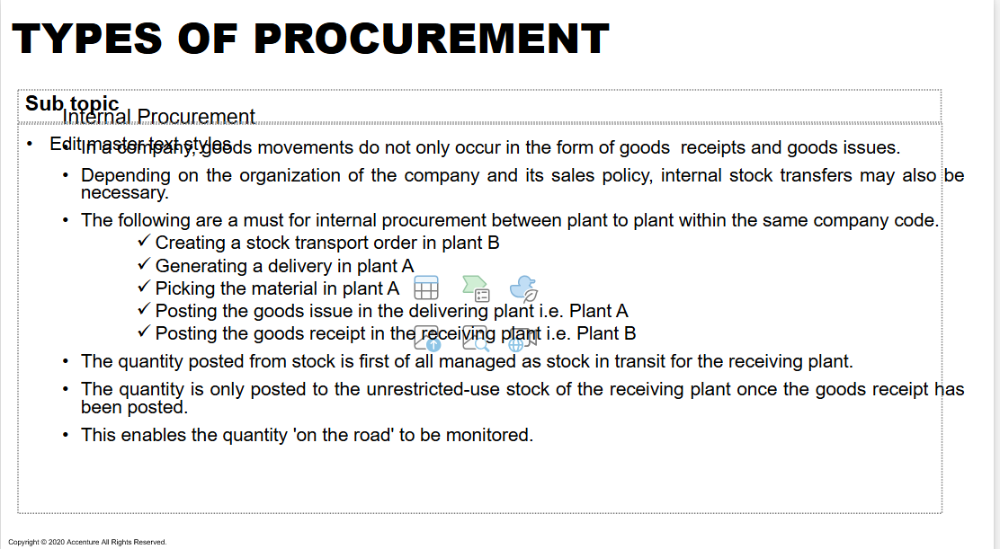
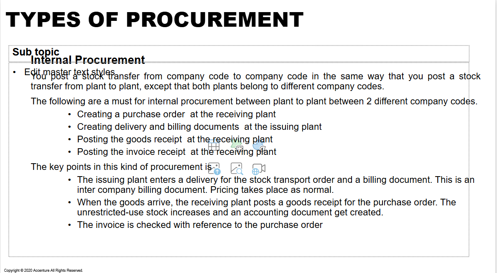

### methods for procurements 

1. procurement for stock

2. procurement for direct consumption 

**procurement for stock** 

* Stock Procurement involves purchasing materials from external vendors and storing them in the company’s inventory or stock. This method is used when the organization wants to maintain control over the materials in stock and keep them available for future use.

key components

* goods receipt

* stock management 
* purchasing order 
* invoice verification 

material must have material master 

**procurement for direct consumoption**

Direct Consumption Procurement (also known as Consumption-Based Procurement) involves purchasing materials or services directly for immediate use or consumption, rather than storing them in inventory. In this method, goods are procured, but they are not stocked—they are directly consumed by production or other operations.

* goods receipt 

* no stock update 

* no stock management 

material may have master 

* one time purchase order

* longer terms contract 

* longer terms scheduling agreement 

### MM integration with other module 

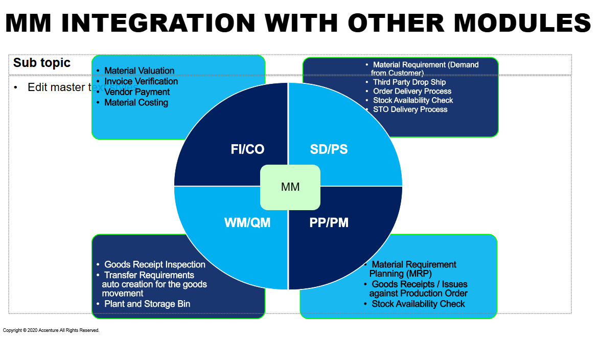

**forms of procurement**

* purchase order 

* purchase requisition
* goods receipt 
* invoice verification 
* stock transfer order 
* RFQ

Here are the **answers** to the 50 questions on the **procurement cycle in SAP MM**:

---

 **Easy Questions (1-10)**

1. **What is the first step in the procurement cycle in SAP MM?**
   - The first step is **creating a Purchase Requisition (PR)**.

2. **Which SAP transaction code is used to create a Purchase Order (PO)?**
   - The transaction code is **ME21N**.

3. **What document is created after a Purchase Requisition (PR) is approved in SAP?**
   - After approval, a **Purchase Order (PO)** is created.

4. **What is the role of Goods Receipt (GR) in the procurement cycle?**
   - **Goods Receipt (GR)** is used to record the physical receipt of goods into the inventory.

5. **How do you verify the receipt of materials in the procurement process?**
   - The receipt of materials is verified using the **Goods Receipt (GR)** document.

6. **What is the purpose of a Purchase Order (PO) in the procurement cycle?**
   - A **Purchase Order (PO)** serves as an agreement between the company and the vendor, specifying the details of goods or services to be supplied.

7. **What is the difference between a Purchase Requisition (PR) and a Purchase Order (PO)?**
   - A **PR** is an internal request to procure materials, while a **PO** is a formal external document sent to the vendor.

8. **In which document is the vendor's payment processed after Goods Receipt?**
   - **Invoice Verification (IV)** document is used to process vendor payments.

9. **What is the significance of Invoice Verification (IV) in the procurement cycle?**
   - **Invoice Verification (IV)** ensures that the vendor's invoice matches the Goods Receipt and Purchase Order for accurate payment.

10. **What is the purpose of the 'MIGO' transaction in SAP MM?**
   - The **MIGO** transaction is used to post Goods Receipt (GR), Goods Issue (GI), or Stock Transfers.

---

 **Medium Questions (11-30)**

11. **What is a Stock Transport Order (STO), and when is it used in the procurement cycle?**
   - **STO** is used for transferring materials from one plant to another within the same company code or different company codes.

12. **How does SAP manage external procurement versus internal procurement?**
   - **External procurement** involves ordering from vendors, while **internal procurement** involves transferring materials between plants within the organization.

13. **What is the role of the vendor master record in the procurement process?**
   - The **vendor master record** stores essential information about the vendor, such as payment terms, contact details, and materials supplied.

14. **What document is used for requesting quotations from vendors in SAP MM?**
   - **Request for Quotation (RFQ)** is used to request quotes from vendors.

15. **How can you track the status of a purchase order in SAP?**
   - The status of a **PO** can be tracked using transaction code **ME23N** or by checking the document flow.

16. **Explain the purpose of a framework agreement in SAP MM.**
   - A **framework agreement** is a long-term agreement between the company and vendor, defining the terms for future purchases over a certain period.

17. **What is the difference between a standard Purchase Order and a Scheduling Agreement?**
   - A **Scheduling Agreement** is a type of framework agreement with predefined delivery schedules, whereas a **PO** is for individual purchase transactions.

18. **How does SAP handle partial deliveries in the procurement cycle?**
   - SAP allows **partial deliveries** by updating the **Goods Receipt** for each partial delivery and adjusting the quantity in the PO.

19. **What happens if the quantity of materials received differs from the quantity ordered in SAP MM?**
   - SAP will allow you to post a **partial Goods Receipt** and notify the discrepancies, which can be adjusted during Invoice Verification.

20. **How do you perform the Goods Issue (GI) in SAP when transferring stock between plants?**
   - The **Goods Issue (GI)** is posted using the **MB1B** or **MIGO** transaction code, and the stock is removed from the sending plant.

21. **What is a consignment stock, and how is it handled in the procurement cycle?**
   - **Consignment stock** refers to goods stored in the company's warehouse but owned by the vendor until they are used. It's handled by posting GR without creating a PO.

22. **How is third-party procurement different from regular procurement in SAP MM?**
   - In **third-party procurement**, the vendor ships goods directly to the customer, bypassing the company’s inventory. In regular procurement, the goods are delivered to the company first.

23. **What is the purpose of creating a Purchase Requisition (PR) in SAP MM?**
   - A **Purchase Requisition (PR)** is created to request the purchase of goods or services within the organization.

24. **How do you process a return of goods in SAP MM?**
   - Goods returns can be processed using transaction code **MIR7** for **Invoice Returns** and **MIGO** for **Goods Returns**.

25. **How does SAP handle procurement with a subcontractor in SAP MM?**
   - In subcontracting, materials are sent to a subcontractor for processing. A **Subcontracting PO** is created, and the processed goods are received from the vendor.

26. **What are the key differences between stock procurement and direct consumption procurement?**
   - In **stock procurement**, goods are stored in inventory, while in **direct consumption procurement**, goods are immediately consumed after receipt.

27. **How is invoice verification (IV) different from goods receipt (GR)?**
   - **Goods Receipt (GR)** is the receipt of materials into stock, while **Invoice Verification (IV)** is the matching of the invoice to the GR and PO for payment.

28. **What is the role of the "MB1B" transaction in the procurement cycle?**
   - **MB1B** is used for posting material movements, such as transferring goods between plants or moving goods from stock to consumption.

29. **How can you monitor stock in transit during the procurement cycle?**
   - Stock in transit is monitored by tracking the **stock transport orders (STOs)** and checking the material status in the system.

30. **What is the purpose of maintaining the vendor evaluation system in SAP MM?**
   - The **vendor evaluation system** helps assess vendor performance based on criteria like quality, delivery time, and price, ensuring effective vendor selection.

---

 **Hard Questions (31-50)**

31. **How can you resolve discrepancies between Goods Receipt and Invoice Receipt in SAP MM?**
   - Discrepancies can be resolved by reviewing the PO, Goods Receipt, and Invoice details, adjusting the data, and posting necessary adjustments in the system.

32. **Explain the impact of procurement in SAP on inventory management and financial accounting.**
   - Procurement affects inventory by updating stock levels. It impacts financial accounting by posting financial entries related to the purchase, such as expenses, payables, and inventory value.

33. **How is the purchase order item category determined in SAP MM?**
   - The **item category** is determined based on the type of goods or services being procured, such as standard items, consignment, or subcontracting.

34. **What are the key differences between a stock transfer order (STO) and a purchase order (PO)?**
   - A **STO** is for transferring stock between plants, while a **PO** is for ordering goods from external vendors.

35. **Describe the process of subcontracting in SAP MM and the associated purchase order types.**
   - Subcontracting involves sending materials to a vendor for processing. A **subcontracting PO** is created, and the processed goods are returned from the vendor.

36. **How do you handle the procurement of materials that are not available in stock but need to be procured urgently?**
   - Urgent procurement can be handled by creating an urgent **Purchase Order (PO)** or using **express delivery** methods with specific conditions.

37. **What are the various stock types in SAP MM, and how are they managed during procurement?**
   - Stock types include **Unrestricted Stock**, **Quality Inspection Stock**, and **Blocked Stock**, and each is managed based on goods receipt and stock posting rules.

38. **How does SAP MM handle the procurement process when multiple vendors are involved?**
   - SAP handles multiple vendors by creating multiple POs or RFQs for each vendor and selecting the best vendor based on price, terms, and conditions.

39. **What are the configuration steps for creating a framework agreement in SAP MM?**
   - The configuration steps include defining agreement types, conditions, and vendor details, and setting up the agreement validity period and terms.

40. **Explain how SAP handles different vendor payment terms during procurement.**
   - **Payment terms** are defined in the vendor master record and determine how payments are processed, including discounts and payment due dates.

41. **How is procurement integrated with SAP Financial Accounting (FI) and Controlling (CO)?**
   - Procurement processes are integrated with **FI** for accounting the purchase and invoice transactions, and **CO** for assigning costs to specific cost centers or orders.

42. **How do you manage batch management in SAP MM during the procurement process?**
   - **Batch management** allows tracking of materials by batches. During procurement, batches can be specified in the PO and tracked during receipt and storage.

43. **What is the role of the "MIR7" transaction code in the procurement cycle?**
   - **MIR7** is used for **Invoice Returns** to reverse or adjust invoices when

 the goods returned differ from the original invoice.

44. **How does SAP handle partial payments for vendors in the procurement cycle?**
   - SAP allows partial payments by posting partial invoices or creating separate payment runs for each partial amount.

45. **Explain the impact of tax codes and tax calculation during the procurement cycle in SAP.**
   - **Tax codes** define the tax rates applicable to goods and services during procurement, ensuring accurate tax calculation during Goods Receipt and Invoice Verification.

46. **How do you handle procurement for international vendors in SAP MM?**
   - International procurement involves setting up **foreign vendor master records**, managing currency differences, and considering import duties, taxes, and shipping details.

47. **What are the different types of procurement methods in SAP MM, and how are they configured?**
   - Types include **standard procurement**, **subcontracting**, and **third-party procurement**. Configuration involves defining the procurement type in the material master and vendor setup.

48. **How can you ensure that goods receipts are properly matched with purchase orders and invoices in SAP MM?**
   - This is done using **three-way matching** between the PO, Goods Receipt (GR), and Invoice (IR) to ensure accuracy before posting the final payment.

49. **How is the process of procurement handled when a material is procured for multiple cost centers in SAP?**
   - Materials can be procured for multiple cost centers by distributing the procurement costs across different cost objects during PO creation.

50. **What are the consequences of posting an invoice without the corresponding Goods Receipt in SAP MM?**
   - Posting an invoice without the corresponding **Goods Receipt** will cause discrepancies, leading to errors in stock management, financial accounting, and payment processing.

---

These answers will guide you through various scenarios in the procurement cycle within SAP MM. Let me know if you need further details!

---

## ⭐ Material Master 

The Material Master in SAP MM is a **central repository** of information related to materials that an organization procures, manufactures, or sells. It contains all the key data about materials, which is needed for procurement, production, sales, and other functions in SAP.

**STRUCTURE**

1. basic data 

2. purchasing view 

3. MRP 
4. storage view 
5. accounting view 
6. sales view 

**KEY DATA**

1. material type 

2. material group 
3. base unit of measure 
4. valuation class 
5. price control
6. stock type 

**material master in procurement process**

* procuremnet 

* inventory management 
* valuation and accounting 

**LEVELS**

* client level 

* plant 
* storage location 
---

* List of material → `MM60`

* `MM04` → track changes in material 
* MM06 → deletion of material 
* MM17 → mass maintenance 
* MMAM → change material type 
* MM50 → extend material view 

## ⭐ VENDOR MASTER 

The Vendor Master in SAP MM is a central repository of all vendor-related information required for procurement, invoice processing, and payment transactions. It contains key data that is used across various SAP modules such as Materials Management (MM), Financial Accounting (FI), and Sales & Distribution (SD).

**LEVELS**

* client 

   * Vendor Name and Address
   * Contact Information (Phone, Email, Fax, etc.)
   * Bank Details (Bank Account, IBAN, SWIFT Code, etc.)
   * Tax Information (GST, VAT, PAN, etc.)
Industry Classification

* company code 

   * Reconciliation Account (Links vendor to G/L Accounting in FI)

   * Payment Terms (Cash discounts, due dates, etc.)
   * Dunning Procedures (Overdue payment reminders)
   * Withholding Tax Information
* purchasing organization 

   * Order Currency

   * Terms of Delivery (Incoterms, Freight Conditions, etc.)
   * Partner Functions (Ordering Address, Invoicing Party, etc.)
   * Purchase Order History (Previous transactions, performance evaluation, etc.)

   ### ⚡ **ACCOUNT GROUP** 

   An Account Group in SAP MM is a classification tool used to define the characteristics and number ranges of Vendor Master Records. It determines which fields are mandatory, optional, or hidden when creating a vendor.

 * Controls the number range (internal/external) assigned to vendors.

 *  Defines which fields are required when creating a vendor (e.g., bank details, tax information).
* Determines the type of vendor (e.g., regular supplier, one-time vendor).
* Helps in data consistency by standardizing vendor information across the system

* has control functions 

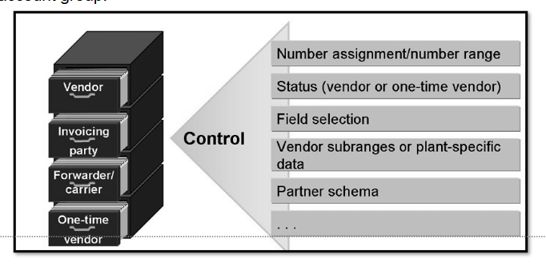
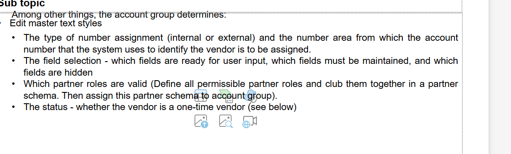

### ⚡ NUMBER ASSIGNMENT

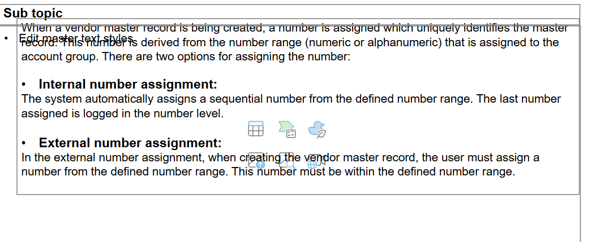

Define Account Groups: `OBD3`

Assign Number Ranges to Vendor Account Groups: `OBAS`

### ⚡**FIELD SELECTION**

Field Selection in SAP MM controls which fields appear as mandatory, optional, display-only, or hidden when maintaining master data (e.g., Material Master, Vendor Master, Purchasing Documents, etc.).

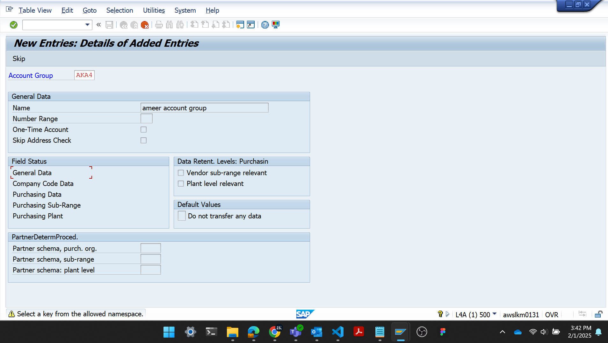

### ⚡ **RENCONCILIATION**

What is a Reconciliation Account?
A Reconciliation Account in SAP is a General Ledger (G/L) account that connects sub-ledgers (e.g., Vendor Accounts in Accounts Payable) to the main ledger (General Ledger - FI module).

🔹 It ensures that all vendor transactions (purchases, invoices, payments) are automatically posted to the correct G/L accounts in Financial Accounting (FI).

🔹 Vendors do not post directly to G/L accounts; instead, they post to vendor sub-ledgers, which in turn update the reconciliation account in FI.

* ✅ Ensures real-time financial integration between MM & FI.

* ✅ Helps in automatic financial posting for vendor transactions.
* ✅ Eliminates the need for manual entries in the General Ledger.
* ✅ Maintains data consistency across FI and MM modules.

1️⃣ A Purchase Order (PO) is created in SAP MM.

2️⃣ A Goods Receipt (GR) is posted, and inventory accounts are updated.

3️⃣ An Invoice is received → The vendor account is credited.

4️⃣ The Reconciliation Account (FI) is updated automatically with the vendor balance.

5️⃣ Vendor Payment is made → The amount is cleared from the Reconciliation Account.

🔹 Example: If a vendor invoice of ₹10,000 is posted, SAP automatically updates:

Vendor Account (Credit ₹10,000) → Sub-ledger
Reconciliation Account (G/L) (Credit ₹10,000) → Main Ledger

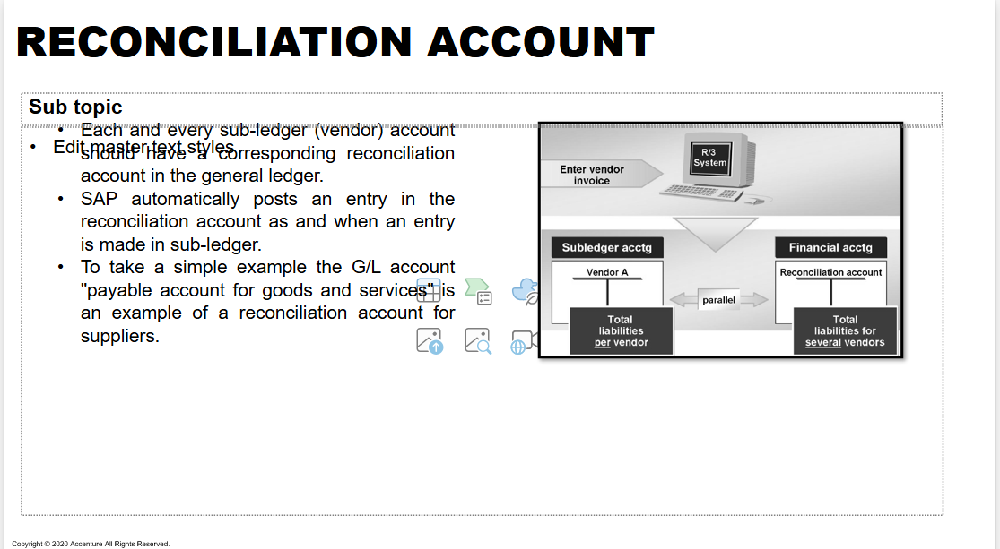

### ⚡ PARTNER ROLES 

In SAP MM (Materials Management), Partner Roles are used to define the different roles that an entity (like a vendor or customer) plays in a business process. These roles help determine the relationship between the business partner (e.g., vendor, customer) and the company in various transactions.

| **Partner Role**       | **Description**                                                                |
|------------------------|--------------------------------------------------------------------------------|
| **VN (Vendor)**         | The main partner in procurement; the entity supplying the goods/services.      |
| **WE (Goods Supplier)** | The partner who delivers goods (could be different from the vendor in some cases). |
| **RE (Payee)**          | The partner receiving payments (often the vendor or an agent).                |
| **OA (Ordering Address)**| The partner who receives the order (can be the vendor or a specific department). |
| **IV (Invoice Address)** | The partner who receives invoices related to the transaction.                |
| **GR (Goods Receipt)**  | The partner associated with goods receipt (not always used in every business scenario). |

---

**CONFIGURATION OF VENDOR MASTER**

* account groups for vendors 

* field selection 
* number assignment 
* levels for vendor data 
* partner roles 

 **1. Different Organization Levels of Vendor Master**

The **Vendor Master** in SAP MM is structured into different levels based on the scope and relevance of the data. The organization levels define where the data will be applicable, ranging from a global level (valid for all company codes) to more specific levels.

The main **organization levels** for vendor master records are:

- **Client Level**: Data at the client level is global and applicable across all company codes. Information such as the **vendor's name** and **address** is maintained at this level.
- **Company Code Level**: Data specific to each company code is maintained at this level. It includes the **vendor’s bank details**, **payment terms**, and **reconciliation accounts**.
- **Purchasing Organization Level**: Data at this level is relevant to procurement activities and includes **partner functions** like **ordering address**, **invoice address**, and **payment terms**.

---

 **2. Significance of Account Group**

The **Account Group** in the vendor master is a crucial element in SAP MM, and its significance lies in:

- **Defining the Number Range**: The account group determines the **number range** for vendor accounts, allowing automatic assignment of vendor account numbers (either internal or external).
- **Controlling Fields**: The account group controls which fields are required, optional, or suppressed when creating or maintaining a vendor master record. Different account groups allow for different sets of required fields based on business needs.
- **Determining Vendor Type**: It helps in categorizing vendors into groups like **external vendors**, **one-time vendors**, and **internal vendors**. The account group helps configure the behavior of the vendor in terms of financial and procurement processes.

---

 **3. Functionality of Partner Functions**

In SAP MM, **Partner Functions** define the different roles a business partner (like a vendor) can play in a transaction. The main functionality of partner functions includes:

- **Role Assignment**: Each partner (vendor) can be assigned multiple roles like **Ordering Address**, **Invoice Address**, **Payee**, **Goods Supplier**, etc. This ensures that the correct party is associated with each part of the process.
- **Transaction Control**: Partner functions control how transactions are handled, such as whether a vendor is used for ordering goods or receiving payments.
- **Flexibility**: They enable flexibility by allowing different partners to handle different parts of the business process (e.g., one partner can be the supplier, another the invoice address).
  
For example, in a **purchase order (PO)**, the **vendor** plays the role of the **ordering address**, but the **invoice address** could be a different entity, allowing separation of responsibilities.

---
 **4. Reconciliation Account and Uses**

A **Reconciliation Account** is a **general ledger (G/L) account** used to aggregate subledger balances from specific vendors. It ensures that transactions are properly reflected in the general ledger for **accounting purposes**.

#### **Uses of Reconciliation Account**:
- **Automatic Posting**: When vendor transactions (like invoices or payments) are posted in the system, the reconciliation account is automatically updated, making financial reporting and analysis easier.
- **Financial Integration**: It links **Material Management (MM)** to **Financial Accounting (FI)**, ensuring that vendor transactions are reflected correctly in the financial statements.
- **Tracking Vendor Balances**: It provides a summary view of all transactions for a vendor in the financial accounts, and it prevents manual updates to the G/L, which reduces errors.

For example, when a vendor’s invoice is posted, the **vendor sub-ledger account** is updated, and the **reconciliation account** in the G/L is also updated automatically.

---

 **5. Different Levels of Vendor Master**

There are **three main levels** in the vendor master record:

- **Client Level**: This level holds **general information** about the vendor such as name, address, and communication data. This data is applicable across all company codes and purchasing organizations.
- **Company Code Level**: Information specific to the company code is maintained at this level, including **payment terms**, **bank details**, and **tax information**.
- **Purchasing Organization Level**: Information relevant to procurement activities is maintained at this level, including **partner functions**, **order data**, and **payment terms** specific to purchasing.

---

**6. Is it Possible to Create Both Internal and External Number Ranges for the Same Vendor Account Group?**

Yes, it is possible to configure both **internal and external number ranges** for the **same vendor account group** in SAP. 

- **Internal Number Range**: SAP automatically assigns numbers to vendor accounts when a vendor is created.
- **External Number Range**: The user manually assigns a number to the vendor when creating the vendor master record.

To create both number ranges for the same account group:

1. **Go to T-Code**: `SPRO` → **IMG** → **Financial Accounting (FI)** → **Accounts Payable** → **Vendor Accounts** → **Define Account Group and Number Range**.
2. Configure **number ranges** for each account group, specifying whether they are **internal** or **external**.

This allows flexibility in managing different types of vendors, especially when dealing with **one-time vendors** or **local/foreign vendors**.

---

 **7. How to Block a Vendor in SAP MM**

Vendors can be blocked at the **vendor master** level to prevent any procurement or payment activities. There are two main types of blocks:

1. **Purchasing Block**: Prevents the vendor from being used in procurement transactions.
2. **Payment Block**: Prevents payments from being made to the vendor.

 **Steps to Block a Vendor**:

1. **Go to T-Code**: `XK02` (Change Vendor) or `MK02` (Change Vendor for Purchasing Organization).
2. Enter the **Vendor Number** and **Company Code**.
3. Navigate to the **Payment Transactions** or **Purchasing Data** tab.
4. Under the **Status** section, set the appropriate block (e.g., **Purchasing Block**, **Payment Block**).
5. **Save** the changes to block the vendor.

By blocking a vendor, you ensure that no further transactions are processed for that vendor until the block is removed.

## ⭐ PURCHASE INFO RECORD 

*  Material Master and Vendor Master Record are used to store material specific information and vendor specific details, respectively.

* Whereas purchasing info record contains information about a specific material and a vendor supplying the
material.
* It can be maintained at purchasing organization level or plant specific, as per the business requirements.
*  The “Purchasing Info record” is used to store the combination a Material and Vendor with the pricing details for
the specific period of time, planned delivery time
* It serves as a source of information for Purchasing.

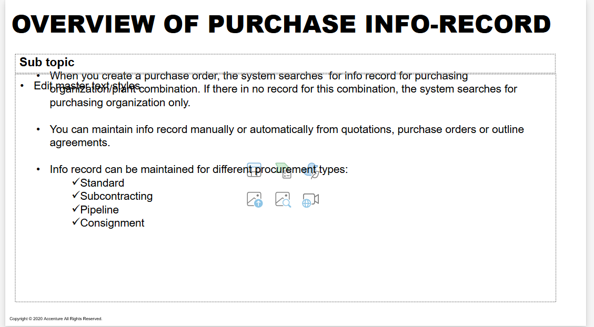

**PRE REQUISITE**

* material master 

* vendor master 

---

* price 

* Tax 

* order unit 

* planned delivery time 
* tolerance 
* conference control data

---

* PIR can created from outline agreemnt / quotation , PO

* PIR can be automatically from contract
* PIR can be updated from outline agreement / quotation, PO

**❓ QUESTION**

1. organization level for purchase info record 

* client level

* company code 

* plant 

* purchasing organization 

2. list of ways PIR can be created 

* ME11 - create purchase info record 

* ME51 - mass creation 

* ME1M - automatically 

* via purchase order, contracts

What types of various purchasing information records we maintained in SAP?

* standard 

* consignment 
* subcontracting 
* pipeline 

What are the different organization levels PIR are created?

* client 

* company code 
* plant 
* purchasing organization 

How PIR is useful in procurement?

What are the other options available to create PIR apart from manual PIRcreation?

* automatically from purhcase order or contract 

* ME1M

* mass creation 
* PIR on purchase requisition

## ⭐ SOURCE LIST 

