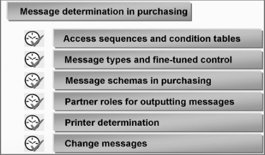
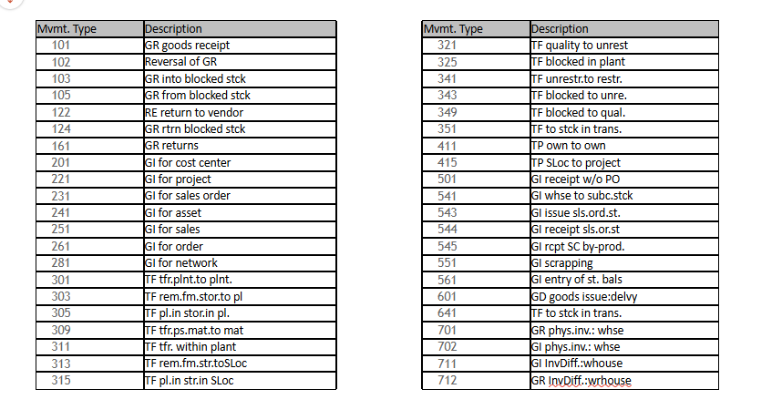
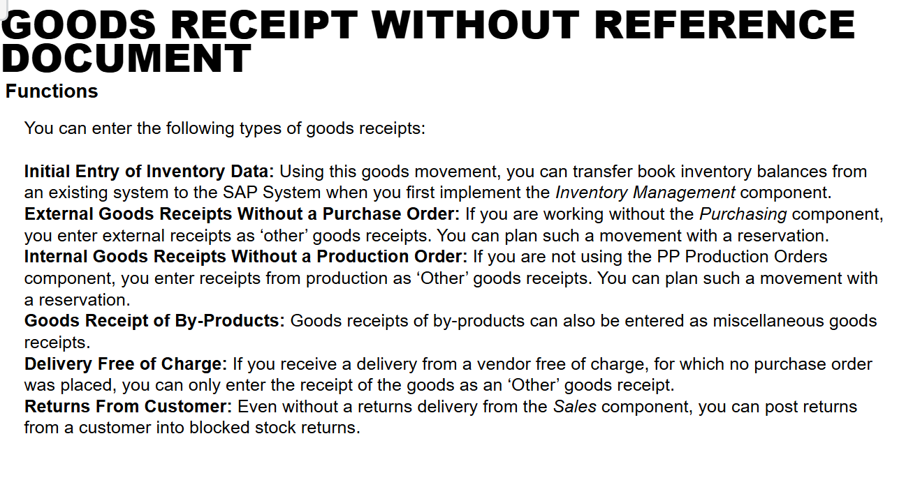
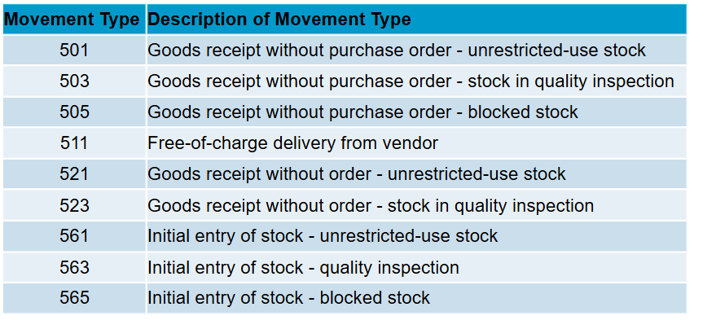
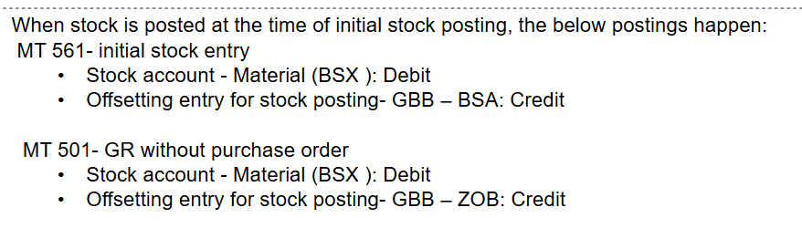
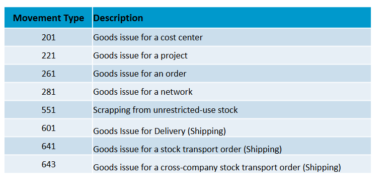
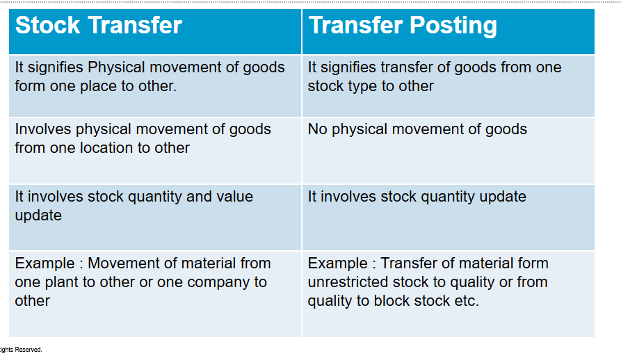
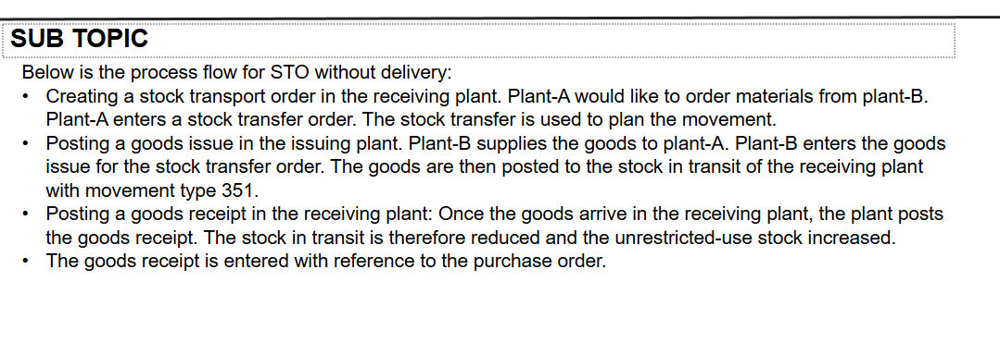
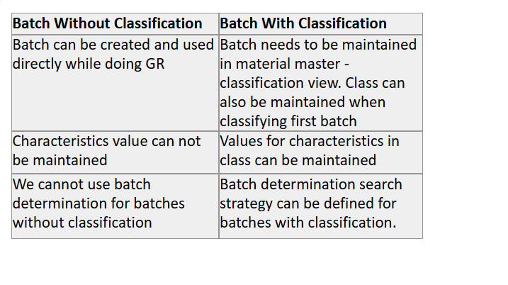

## ⭐ organization structure 

The organizational structure in SAP MM (Materials Management) defines how a company is structured for procurement, inventory management, and material planning. It consists of different organizational units

| **Level** | **Description** |
|-----------|---------------|
| **Client** | Highest-level organization, representing a corporate group. |
| **Company Code (CC)** | Legal entity for financial reporting (FI module). |
| **Plant** | Physical location for production, storage, or distribution. |
| **Storage Location (SLoc)** | Subdivision of a plant for material storage. |
| **Purchasing Organization (POrg)** | Responsible for procurement activities. |
| **Purchasing Group (PGrp)** | Group of buyers responsible for procurement. |

---

**client** 

* data  in client may not accessed by another client

* client refers to single group of company

**company code**

* organization unit within the client

* where financial entries are produced 
* Producing its own balance sheets and Profit/loss statements
* Several company codes can be set up within the client
* Company code is defined as 4-digit Alpha numeric key ( e.g. SAP1)

**plant** 

* Is an operating unit, within a Company
Code, mostly defined for Production Center
or Material Requirements Planning or
simply a grouping of several Storage
Locations.

* Is assigned to a company code; many
plants can be assigned to one company
code.

* Is a place where either materials are
produced or goods/services are handled.

* it has own material master data

**Purchasing organization** 

* A purchasing organization is an organization unit which
is responsible for procuring material/Service

* The way in which purchasing organization is assigned to
company codes and plants will determine the
procurement method.

* Purchasing organization can be assigned to either
Company code or Plant based on the business
requirement

**What is a Reference Purchasing Organization?**

A Reference Purchasing Organization is a special type of purchasing organization in SAP MM that allows companies to centralize contract negotiations while enabling multiple purchasing organizations to use the same contract terms for procurement.

**storage location** 

* A storage location is an organizational unit
and Subdivision of a plant.

* Storage location defines a location for
materials.

* Stocks of material can be managed within a
plant in different storage locations for
differentiation

* Storage Location is the lowest organizational
level in MM and it helps to differentiate the
stocks.

* stocks of the material are physcially managed 

* stocks are managed at storage location in quantity level only, not an value basis

* storage location always belongs to plants 

* 4 digit alphanumberic key 

**purchasing group** 

* A purchasing group is an organization unit which is
responsible for procuring a class of materials for internal
units.

* **Responsible for certain type of material or service
procurement**

* Deals with the vendor by monitoring the purchasing
activities

* It is defined as 3 - digit alpha numeric key in the system.

* purchasing group is not directly assigned to purchasing organization

* purchasing group assigned to a maetrial in material master 

Here are **50 SAP MM Organizational Structure questions with answers** categorized into **Easy, Medium, and Hard** levels.

---

**🟢 EASY LEVEL (1-20)**  
1. **What is a Client in SAP MM?**  
   - The **Client** is the highest level in the SAP hierarchy and represents an independent unit with its own data and configuration.

2. **What is the purpose of a Company Code in SAP MM?**  
   - A **Company Code** is the smallest legal entity in SAP FI (Finance) for which financial statements are prepared.

3. **What is a Plant in SAP MM?**  
   - A **Plant** is an organizational unit that represents a manufacturing location, distribution center, or warehouse.

4. **What is a Storage Location used for?**  
   - A **Storage Location** is a subdivision of a Plant where materials are stored.

5. **What is the role of a Purchasing Organization?**  
   - A **Purchasing Organization** is responsible for procurement activities and contract negotiations.

6. **What is a Purchasing Group in SAP MM?**  
   - A **Purchasing Group** represents the buyers responsible for procurement transactions.

7. **Can multiple Plants be assigned to a single Company Code?**  
   - **Yes**, multiple Plants can be assigned to a single Company Code.

8. **How do you define a Plant in SAP MM? (T-Code)**  
   - T-Code: **OX10**

9. **What T-Code is used to assign a Plant to a Company Code?**  
   - T-Code: **OX18**

10. **Can a single Purchasing Organization serve multiple Company Codes?**  
   - **Yes**, if it is a **Cross-Company Code Purchasing Organization**.

11. **What is the highest level in the SAP MM Organizational Structure?**  
   - **Client**

12. **What is the transaction code to define a Storage Location?**  
   - T-Code: **OMMM**

13. **How many Purchasing Groups can be assigned to a Purchasing Organization?**  
   - **Multiple** Purchasing Groups can be assigned.

14. **Can a Plant exist without being assigned to a Company Code?**  
   - **No**, every Plant must be assigned to a Company Code.

15. **What T-Code is used to assign a Purchasing Organization to a Plant?**  
   - T-Code: **OX17**

16. **Can a Storage Location be assigned to multiple Plants?**  
   - **No**, a Storage Location is Plant-specific.

17. **What is the purpose of a Reference Purchasing Organization?**  
   - A **Reference Purchasing Organization** is used for **central contract negotiations** while multiple Purchasing Organizations use the contracts.

18. **What is the transaction code for editing a Plant in SAP MM?**  
   - T-Code: **OX10**

19. **What T-Code is used to create a Purchasing Organization?**  
   - T-Code: **OX08**

20. **What is the default factory calendar assigned at the Plant level?**  
   - The default **Factory Calendar** depends on country-specific working days.

---

 **🟡 MEDIUM LEVEL (21-40)**  

21. **Explain the relationship between Plant and Company Code.**  
   - A **Company Code** can have **multiple Plants**, but a **Plant belongs to only one Company Code**.

22. **Can multiple Storage Locations be assigned to a single Plant?**  
   - **Yes**, multiple Storage Locations can be assigned.

23. **What is the difference between a Standard Purchasing Organization and a Reference Purchasing Organization?**  
   - A **Standard POrg** handles procurement, while a **Reference POrg** only negotiates contracts.

24. **How does a Centralized Purchasing Organization work?**  
   - A single **Purchasing Organization** handles procurement for multiple Company Codes.

25. **Can a Purchasing Organization be assigned to multiple Plants?**  
   - **Yes**, a **Purchasing Organization** can serve multiple Plants.

26. **What is the purpose of a Cross-Company Code Purchasing Organization?**  
   - It allows a **Purchasing Organization** to manage procurement across **multiple Company Codes**.

27. **What are the main data fields required when defining a Plant in SAP MM?**  
   - Plant Name, Address, Factory Calendar, Region, Country Code.

28. **What is the impact of changing the Company Code assignment of a Plant?**  
   - It can impact **accounting, procurement, and inventory management**.

29. **Can a Storage Location exist without a Plant?**  
   - **No**, every Storage Location must belong to a Plant.

30. **How is a Plant linked to Material Master data?**  
   - Through **Plant-Specific Views** in the Material Master.

31. **What are the key tables storing Organizational Structure data in SAP MM?**  
   - **T001W** (Plants), **T024E** (Purchasing Organizations), **T001K** (Company Codes).

32. **How does a Purchasing Organization influence procurement processes?**  
   - It defines **vendor selection, contract terms, and purchasing conditions**.

33. **What happens if a Purchasing Organization is not assigned to a Plant?**  
   - Procurement cannot be carried out at that Plant.

34. **What are the limitations of a Reference Purchasing Organization?**  
   - It cannot directly create Purchase Orders.

35. **How can you check the assignment of a Plant to a Company Code?**  
   - Using T-Code **OX18**.

36. **What is the role of a Factory Calendar in a Plant?**  
   - It defines **working days and holidays** for material planning.

37. **How do you transfer materials between two Storage Locations within the same Plant?**  
   - Using a **Transfer Posting (T-Code: MIGO / MB1B)**.

38. **What is the difference between a Plant-specific POrg and a Company-specific POrg?**  
   - A **Plant-specific POrg** is limited to a Plant, while a **Company-specific POrg** covers multiple Plants in a Company Code.

39. **How do you configure a new Plant in SAP MM?**  
   - Using **OX10** → Assign it to a Company Code in **OX18**.

40. **How does the organizational structure impact the procurement process?**  
   - It defines **who procures, where goods are stored, and how invoices are processed**.

---

 **🔴 HARD LEVEL (41-50)**  

41. **How do you change a Plant assignment without affecting open Purchase Orders?**  
   - Ensure **Purchase Orders are completed or reassigned** before making changes in **OX18**.

42. **Explain how a Cross-Company Code Purchasing Organization affects financial transactions.**  
   - It enables **inter-company procurement** while managing costs at different levels.

43. **What are the real-time scenarios where a Reference Purchasing Organization is useful?**  
   - In **global procurement**, where contracts are negotiated centrally but executed locally.

44. **How can you set up a Global Purchasing Organization for multiple Company Codes?**  
   - Create a **Cross-Company Code POrg** and assign it to multiple Company Codes.

45. **Explain the dependencies between a Plant and a Storage Location in Inventory Management.**  
   - **Storage Locations** are specific to a **Plant**, affecting inventory tracking.

46. **How does the organizational structure in SAP MM integrate with SAP SD and SAP FI?**  
   - **MM → FI**: Stock valuation  
   - **MM → SD**: Stock availability for sales  

47. **How would you approach merging two Plants under one Company Code?**  
   - Transfer materials, update master data, and reassign configurations.

48. **What is the impact of deleting a Storage Location in SAP MM?**  
   - It affects **stock availability and historical transactions**.

49. **What is the relationship between Company Code, Controlling Area, and Plant in SAP?**  
   - A **Company Code** belongs to a **Controlling Area**, and **Plants belong to a Company Code**.

50. **What are the challenges in configuring a new organizational structure in SAP MM for a multinational company?**  
   - Legal compliance, multi-currency handling, and logistics complexity.

---

## ⭐ procurement cycle 

⭐ **types of procurement** 

* internal 

* external 

---

 **1️⃣ External Procurement**

**External Procurement** involves acquiring goods or services from external vendors or suppliers outside the organization. This is the most common method of procurement and includes the process of sourcing, purchasing, and receiving materials from external sources.

**Key Points in External Procurement**:
- **Source of Supply**: The materials are obtained from third-party vendors or suppliers.
- **Stock Procurement**: The goods are bought and stored in the company's inventory.
- **Consumption-Based Procurement**: The goods are consumed immediately or used directly in production.
- **Subcontracting**: Semi-finished goods are sent to an external supplier for processing, and the finished goods are returned.
- **Third-Party Procurement**: Goods are directly delivered from a vendor to the customer, bypassing the company’s inventory.

---

 **2️⃣ Internal Procurement**

**Internal Procurement** involves moving goods or materials from one plant, warehouse, or storage location to another within the same organization. This is commonly referred to as **Stock Transfer** or **Inter-Plant Transfer**.

 **Key Points in Internal Procurement**:
- **Source of Supply**: The goods are obtained from the organization's own plants or storage locations, not external suppliers.
- **Stock Transfer**: Material is moved from one location to another within the organization.
- **No Purchase Order**: Since the transaction happens within the same organization, there is no need for a formal purchase order.
- **No Vendor Involvement**: No external vendor is involved in the process.
  

---

 **Key Differences Between Internal and External Procurement:**

| Aspect                          | **External Procurement**                                       | **Internal Procurement**                                      |
|----------------------------------|---------------------------------------------------------------|---------------------------------------------------------------|
| **Source of Supply**             | External vendors/suppliers                                   | Internal plants or storage locations                          |
| **Transaction Involvement**      | Involves a purchase order (PO), vendor, and payment process. | Involves stock transfer between locations, no vendor.          |
| **Materials Movement**           | Materials are received from external suppliers into stock.   | Materials are moved between different plants or storage locations. |
| **Procurement Process**          | Full procurement process (PO, GR, Invoice, Payment).         | Simple stock transfer or consignment process.                 |
| **Example**                      | Buying raw materials or finished goods from an external supplier. | Transferring finished goods from one warehouse to another.    |

---

 **Use Cases:**

 **External Procurement**:
- Used when the organization needs materials or services from outside suppliers, such as raw materials, finished goods, or services like consulting.
  
 **Internal Procurement**:
- Used for internal transfers, where materials need to be moved from one location or plant to another within the same organization (e.g., moving raw materials from warehouse A to production plant B).

### methods for procurements 

1. procurement for stock

2. procurement for direct consumption 

**procurement for stock** 

* Stock Procurement involves purchasing materials from external vendors and storing them in the company’s inventory or stock. This method is used when the organization wants to maintain control over the materials in stock and keep them available for future use.

key components

* goods receipt

* stock management 
* purchasing order 
* invoice verification 

material must have material master 

**procurement for direct consumoption**

Direct Consumption Procurement (also known as Consumption-Based Procurement) involves purchasing materials or services directly for immediate use or consumption, rather than storing them in inventory. In this method, goods are procured, but they are not stocked—they are directly consumed by production or other operations.

* goods receipt 

* no stock update 

* no stock management 

material may have master 

* one time purchase order

* longer terms contract 

* longer terms scheduling agreement 

### MM integration with other module 

**forms of procurement**

* purchase order 

* purchase requisition
* goods receipt 
* invoice verification 
* stock transfer order 
* RFQ

Here are the **answers** to the 50 questions on the **procurement cycle in SAP MM**:

---

 **Easy Questions (1-10)**

1. **What is the first step in the procurement cycle in SAP MM?**
   - The first step is **creating a Purchase Requisition (PR)**.

2. **Which SAP transaction code is used to create a Purchase Order (PO)?**
   - The transaction code is **ME21N**.

3. **What document is created after a Purchase Requisition (PR) is approved in SAP?**
   - After approval, a **Purchase Order (PO)** is created.

4. **What is the role of Goods Receipt (GR) in the procurement cycle?**
   - **Goods Receipt (GR)** is used to record the physical receipt of goods into the inventory.

5. **How do you verify the receipt of materials in the procurement process?**
   - The receipt of materials is verified using the **Goods Receipt (GR)** document.

6. **What is the purpose of a Purchase Order (PO) in the procurement cycle?**
   - A **Purchase Order (PO)** serves as an agreement between the company and the vendor, specifying the details of goods or services to be supplied.

7. **What is the difference between a Purchase Requisition (PR) and a Purchase Order (PO)?**
   - A **PR** is an internal request to procure materials, while a **PO** is a formal external document sent to the vendor.

8. **In which document is the vendor's payment processed after Goods Receipt?**
   - **Invoice Verification (IV)** document is used to process vendor payments.

9. **What is the significance of Invoice Verification (IV) in the procurement cycle?**
   - **Invoice Verification (IV)** ensures that the vendor's invoice matches the Goods Receipt and Purchase Order for accurate payment.

10. **What is the purpose of the 'MIGO' transaction in SAP MM?**
   - The **MIGO** transaction is used to post Goods Receipt (GR), Goods Issue (GI), or Stock Transfers.

---

 **Medium Questions (11-30)**

11. **What is a Stock Transport Order (STO), and when is it used in the procurement cycle?**
   - **STO** is used for transferring materials from one plant to another within the same company code or different company codes.

12. **How does SAP manage external procurement versus internal procurement?**
   - **External procurement** involves ordering from vendors, while **internal procurement** involves transferring materials between plants within the organization.

13. **What is the role of the vendor master record in the procurement process?**
   - The **vendor master record** stores essential information about the vendor, such as payment terms, contact details, and materials supplied.

14. **What document is used for requesting quotations from vendors in SAP MM?**
   - **Request for Quotation (RFQ)** is used to request quotes from vendors.

15. **How can you track the status of a purchase order in SAP?**
   - The status of a **PO** can be tracked using transaction code **ME23N** or by checking the document flow.

16. **Explain the purpose of a framework agreement in SAP MM.**
   - A **framework agreement** is a long-term agreement between the company and vendor, defining the terms for future purchases over a certain period.

17. **What is the difference between a standard Purchase Order and a Scheduling Agreement?**
   - A **Scheduling Agreement** is a type of framework agreement with predefined delivery schedules, whereas a **PO** is for individual purchase transactions.

18. **How does SAP handle partial deliveries in the procurement cycle?**
   - SAP allows **partial deliveries** by updating the **Goods Receipt** for each partial delivery and adjusting the quantity in the PO.

19. **What happens if the quantity of materials received differs from the quantity ordered in SAP MM?**
   - SAP will allow you to post a **partial Goods Receipt** and notify the discrepancies, which can be adjusted during Invoice Verification.

20. **How do you perform the Goods Issue (GI) in SAP when transferring stock between plants?**
   - The **Goods Issue (GI)** is posted using the **MB1B** or **MIGO** transaction code, and the stock is removed from the sending plant.

21. **What is a consignment stock, and how is it handled in the procurement cycle?**
   - **Consignment stock** refers to goods stored in the company's warehouse but owned by the vendor until they are used. It's handled by posting GR without creating a PO.

22. **How is third-party procurement different from regular procurement in SAP MM?**
   - In **third-party procurement**, the vendor ships goods directly to the customer, bypassing the company’s inventory. In regular procurement, the goods are delivered to the company first.

23. **What is the purpose of creating a Purchase Requisition (PR) in SAP MM?**
   - A **Purchase Requisition (PR)** is created to request the purchase of goods or services within the organization.

24. **How do you process a return of goods in SAP MM?**
   - Goods returns can be processed using transaction code **MIR7** for **Invoice Returns** and **MIGO** for **Goods Returns**.

25. **How does SAP handle procurement with a subcontractor in SAP MM?**
   - In subcontracting, materials are sent to a subcontractor for processing. A **Subcontracting PO** is created, and the processed goods are received from the vendor.

26. **What are the key differences between stock procurement and direct consumption procurement?**
   - In **stock procurement**, goods are stored in inventory, while in **direct consumption procurement**, goods are immediately consumed after receipt.

27. **How is invoice verification (IV) different from goods receipt (GR)?**
   - **Goods Receipt (GR)** is the receipt of materials into stock, while **Invoice Verification (IV)** is the matching of the invoice to the GR and PO for payment.

28. **What is the role of the "MB1B" transaction in the procurement cycle?**
   - **MB1B** is used for posting material movements, such as transferring goods between plants or moving goods from stock to consumption.

29. **How can you monitor stock in transit during the procurement cycle?**
   - Stock in transit is monitored by tracking the **stock transport orders (STOs)** and checking the material status in the system.

30. **What is the purpose of maintaining the vendor evaluation system in SAP MM?**
   - The **vendor evaluation system** helps assess vendor performance based on criteria like quality, delivery time, and price, ensuring effective vendor selection.

---

 **Hard Questions (31-50)**

31. **How can you resolve discrepancies between Goods Receipt and Invoice Receipt in SAP MM?**
   - Discrepancies can be resolved by reviewing the PO, Goods Receipt, and Invoice details, adjusting the data, and posting necessary adjustments in the system.

32. **Explain the impact of procurement in SAP on inventory management and financial accounting.**
   - Procurement affects inventory by updating stock levels. It impacts financial accounting by posting financial entries related to the purchase, such as expenses, payables, and inventory value.

33. **How is the purchase order item category determined in SAP MM?**
   - The **item category** is determined based on the type of goods or services being procured, such as standard items, consignment, or subcontracting.

34. **What are the key differences between a stock transfer order (STO) and a purchase order (PO)?**
   - A **STO** is for transferring stock between plants, while a **PO** is for ordering goods from external vendors.

35. **Describe the process of subcontracting in SAP MM and the associated purchase order types.**
   - Subcontracting involves sending materials to a vendor for processing. A **subcontracting PO** is created, and the processed goods are returned from the vendor.

36. **How do you handle the procurement of materials that are not available in stock but need to be procured urgently?**
   - Urgent procurement can be handled by creating an urgent **Purchase Order (PO)** or using **express delivery** methods with specific conditions.

37. **What are the various stock types in SAP MM, and how are they managed during procurement?**
   - Stock types include **Unrestricted Stock**, **Quality Inspection Stock**, and **Blocked Stock**, and each is managed based on goods receipt and stock posting rules.

38. **How does SAP MM handle the procurement process when multiple vendors are involved?**
   - SAP handles multiple vendors by creating multiple POs or RFQs for each vendor and selecting the best vendor based on price, terms, and conditions.

39. **What are the configuration steps for creating a framework agreement in SAP MM?**
   - The configuration steps include defining agreement types, conditions, and vendor details, and setting up the agreement validity period and terms.

40. **Explain how SAP handles different vendor payment terms during procurement.**
   - **Payment terms** are defined in the vendor master record and determine how payments are processed, including discounts and payment due dates.

41. **How is procurement integrated with SAP Financial Accounting (FI) and Controlling (CO)?**
   - Procurement processes are integrated with **FI** for accounting the purchase and invoice transactions, and **CO** for assigning costs to specific cost centers or orders.

42. **How do you manage batch management in SAP MM during the procurement process?**
   - **Batch management** allows tracking of materials by batches. During procurement, batches can be specified in the PO and tracked during receipt and storage.

43. **What is the role of the "MIR7" transaction code in the procurement cycle?**
   - **MIR7** is used for **Invoice Returns** to reverse or adjust invoices when

 the goods returned differ from the original invoice.

44. **How does SAP handle partial payments for vendors in the procurement cycle?**
   - SAP allows partial payments by posting partial invoices or creating separate payment runs for each partial amount.

45. **Explain the impact of tax codes and tax calculation during the procurement cycle in SAP.**
   - **Tax codes** define the tax rates applicable to goods and services during procurement, ensuring accurate tax calculation during Goods Receipt and Invoice Verification.

46. **How do you handle procurement for international vendors in SAP MM?**
   - International procurement involves setting up **foreign vendor master records**, managing currency differences, and considering import duties, taxes, and shipping details.

47. **What are the different types of procurement methods in SAP MM, and how are they configured?**
   - Types include **standard procurement**, **subcontracting**, and **third-party procurement**. Configuration involves defining the procurement type in the material master and vendor setup.

48. **How can you ensure that goods receipts are properly matched with purchase orders and invoices in SAP MM?**
   - This is done using **three-way matching** between the PO, Goods Receipt (GR), and Invoice (IR) to ensure accuracy before posting the final payment.

49. **How is the process of procurement handled when a material is procured for multiple cost centers in SAP?**
   - Materials can be procured for multiple cost centers by distributing the procurement costs across different cost objects during PO creation.

50. **What are the consequences of posting an invoice without the corresponding Goods Receipt in SAP MM?**
   - Posting an invoice without the corresponding **Goods Receipt** will cause discrepancies, leading to errors in stock management, financial accounting, and payment processing.

---

These answers will guide you through various scenarios in the procurement cycle within SAP MM. Let me know if you need further details!

---

## ⭐ Material Master 

The Material Master in SAP MM is a **central repository** of information related to materials that an organization procures, manufactures, or sells. It contains all the key data about materials, which is needed for procurement, production, sales, and other functions in SAP.

**STRUCTURE**

1. basic data 

2. purchasing view 

3. MRP 
4. storage view 
5. accounting view 
6. sales view 

**KEY DATA**

1. material type 

2. material group 
3. base unit of measure 
4. valuation class 
5. price control
6. stock type 

**material master in procurement process**

* procuremnet 

* inventory management 
* valuation and accounting 

**LEVELS**

* client level 

* plant 
* storage location 
---

* List of material → `MM60`

* `MM04` → track changes in material 
* MM06 → deletion of material 
* MM17 → mass maintenance 
* MMAM → change material type 
* MM50 → extend material view 

### ⚡ MRP 

The MRP (Material Requirements Planning) View in the Material Master is crucial for planning and managing material procurement and production. It defines how a material is planned, procured, and replenished in SAP MM.
## ⭐ VENDOR MASTER 

The Vendor Master in SAP MM is a central repository of all vendor-related information required for procurement, invoice processing, and payment transactions. It contains key data that is used across various SAP modules such as Materials Management (MM), Financial Accounting (FI), and Sales & Distribution (SD).

**LEVELS**

* client 

   * Vendor Name and Address
   * Contact Information (Phone, Email, Fax, etc.)
   * Bank Details (Bank Account, IBAN, SWIFT Code, etc.)
   * Tax Information (GST, VAT, PAN, etc.)
Industry Classification

* company code 

   * Reconciliation Account (Links vendor to G/L Accounting in FI)

   * Payment Terms (Cash discounts, due dates, etc.)
   * Dunning Procedures (Overdue payment reminders)
   * Withholding Tax Information
* purchasing organization 

   * Order Currency

   * Terms of Delivery (Incoterms, Freight Conditions, etc.)
   * Partner Functions (Ordering Address, Invoicing Party, etc.)
   * Purchase Order History (Previous transactions, performance evaluation, etc.)

   ### ⚡ **ACCOUNT GROUP** 

   An Account Group in SAP MM is a classification tool used to define the characteristics and number ranges of Vendor Master Records. It determines which fields are mandatory, optional, or hidden when creating a vendor.

 * Controls the number range (internal/external) assigned to vendors.

 *  Defines which fields are required when creating a vendor (e.g., bank details, tax information).
* Determines the type of vendor (e.g., regular supplier, one-time vendor).
* Helps in data consistency by standardizing vendor information across the system

* has control functions 

### ⚡ NUMBER ASSIGNMENT

Define Account Groups: `OBD3`

Assign Number Ranges to Vendor Account Groups: `OBAS`

### ⚡**FIELD SELECTION**

Field Selection in SAP MM controls which fields appear as mandatory, optional, display-only, or hidden when maintaining master data (e.g., Material Master, Vendor Master, Purchasing Documents, etc.).

### ⚡ **RENCONCILIATION**

What is a Reconciliation Account?
A Reconciliation Account in SAP is a General Ledger (G/L) account that connects sub-ledgers (e.g., Vendor Accounts in Accounts Payable) to the main ledger (General Ledger - FI module).

🔹 It ensures that all vendor transactions (purchases, invoices, payments) are automatically posted to the correct G/L accounts in Financial Accounting (FI).

🔹 Vendors do not post directly to G/L accounts; instead, they post to vendor sub-ledgers, which in turn update the reconciliation account in FI.

* ✅ Ensures real-time financial integration between MM & FI.

* ✅ Helps in automatic financial posting for vendor transactions.
* ✅ Eliminates the need for manual entries in the General Ledger.
* ✅ Maintains data consistency across FI and MM modules.

1️⃣ A Purchase Order (PO) is created in SAP MM.

2️⃣ A Goods Receipt (GR) is posted, and inventory accounts are updated.

3️⃣ An Invoice is received → The vendor account is credited.

4️⃣ The Reconciliation Account (FI) is updated automatically with the vendor balance.

5️⃣ Vendor Payment is made → The amount is cleared from the Reconciliation Account.

🔹 Example: If a vendor invoice of ₹10,000 is posted, SAP automatically updates:

Vendor Account (Credit ₹10,000) → Sub-ledger
Reconciliation Account (G/L) (Credit ₹10,000) → Main Ledger

### ⚡ PARTNER ROLES 

In SAP MM (Materials Management), Partner Roles are used to define the different roles that an entity (like a vendor or customer) plays in a business process. These roles help determine the relationship between the business partner (e.g., vendor, customer) and the company in various transactions.

| **Partner Role**       | **Description**                                                                |
|------------------------|--------------------------------------------------------------------------------|
| **VN (Vendor)**         | The main partner in procurement; the entity supplying the goods/services.      |
| **WE (Goods Supplier)** | The partner who delivers goods (could be different from the vendor in some cases). |
| **RE (Payee)**          | The partner receiving payments (often the vendor or an agent).                |
| **OA (Ordering Address)**| The partner who receives the order (can be the vendor or a specific department). |
| **IV (Invoice Address)** | The partner who receives invoices related to the transaction.                |
| **GR (Goods Receipt)**  | The partner associated with goods receipt (not always used in every business scenario). |

---

**CONFIGURATION OF VENDOR MASTER**

* account groups for vendors 

* field selection 
* number assignment 
* levels for vendor data 
* partner roles 

 **1. Different Organization Levels of Vendor Master**

The **Vendor Master** in SAP MM is structured into different levels based on the scope and relevance of the data. The organization levels define where the data will be applicable, ranging from a global level (valid for all company codes) to more specific levels.

The main **organization levels** for vendor master records are:

- **Client Level**: Data at the client level is global and applicable across all company codes. Information such as the **vendor's name** and **address** is maintained at this level.
- **Company Code Level**: Data specific to each company code is maintained at this level. It includes the **vendor’s bank details**, **payment terms**, and **reconciliation accounts**.
- **Purchasing Organization Level**: Data at this level is relevant to procurement activities and includes **partner functions** like **ordering address**, **invoice address**, and **payment terms**.

---

 **2. Significance of Account Group**

The **Account Group** in the vendor master is a crucial element in SAP MM, and its significance lies in:

- **Defining the Number Range**: The account group determines the **number range** for vendor accounts, allowing automatic assignment of vendor account numbers (either internal or external).
- **Controlling Fields**: The account group controls which fields are required, optional, or suppressed when creating or maintaining a vendor master record. Different account groups allow for different sets of required fields based on business needs.
- **Determining Vendor Type**: It helps in categorizing vendors into groups like **external vendors**, **one-time vendors**, and **internal vendors**. The account group helps configure the behavior of the vendor in terms of financial and procurement processes.

---

 **3. Functionality of Partner Functions**

In SAP MM, **Partner Functions** define the different roles a business partner (like a vendor) can play in a transaction. The main functionality of partner functions includes:

- **Role Assignment**: Each partner (vendor) can be assigned multiple roles like **Ordering Address**, **Invoice Address**, **Payee**, **Goods Supplier**, etc. This ensures that the correct party is associated with each part of the process.
- **Transaction Control**: Partner functions control how transactions are handled, such as whether a vendor is used for ordering goods or receiving payments.
- **Flexibility**: They enable flexibility by allowing different partners to handle different parts of the business process (e.g., one partner can be the supplier, another the invoice address).
  
For example, in a **purchase order (PO)**, the **vendor** plays the role of the **ordering address**, but the **invoice address** could be a different entity, allowing separation of responsibilities.

---
 **4. Reconciliation Account and Uses**

A **Reconciliation Account** is a **general ledger (G/L) account** used to aggregate subledger balances from specific vendors. It ensures that transactions are properly reflected in the general ledger for **accounting purposes**.

#### **Uses of Reconciliation Account**:
- **Automatic Posting**: When vendor transactions (like invoices or payments) are posted in the system, the reconciliation account is automatically updated, making financial reporting and analysis easier.
- **Financial Integration**: It links **Material Management (MM)** to **Financial Accounting (FI)**, ensuring that vendor transactions are reflected correctly in the financial statements.
- **Tracking Vendor Balances**: It provides a summary view of all transactions for a vendor in the financial accounts, and it prevents manual updates to the G/L, which reduces errors.

For example, when a vendor’s invoice is posted, the **vendor sub-ledger account** is updated, and the **reconciliation account** in the G/L is also updated automatically.

---

 **5. Different Levels of Vendor Master**

There are **three main levels** in the vendor master record:

- **Client Level**: This level holds **general information** about the vendor such as name, address, and communication data. This data is applicable across all company codes and purchasing organizations.
- **Company Code Level**: Information specific to the company code is maintained at this level, including **payment terms**, **bank details**, and **tax information**.
- **Purchasing Organization Level**: Information relevant to procurement activities is maintained at this level, including **partner functions**, **order data**, and **payment terms** specific to purchasing.

---

**6. Is it Possible to Create Both Internal and External Number Ranges for the Same Vendor Account Group?**

Yes, it is possible to configure both **internal and external number ranges** for the **same vendor account group** in SAP. 

- **Internal Number Range**: SAP automatically assigns numbers to vendor accounts when a vendor is created.
- **External Number Range**: The user manually assigns a number to the vendor when creating the vendor master record.

To create both number ranges for the same account group:

1. **Go to T-Code**: `SPRO` → **IMG** → **Financial Accounting (FI)** → **Accounts Payable** → **Vendor Accounts** → **Define Account Group and Number Range**.
2. Configure **number ranges** for each account group, specifying whether they are **internal** or **external**.

This allows flexibility in managing different types of vendors, especially when dealing with **one-time vendors** or **local/foreign vendors**.

---

 **7. How to Block a Vendor in SAP MM**

Vendors can be blocked at the **vendor master** level to prevent any procurement or payment activities. There are two main types of blocks:

1. **Purchasing Block**: Prevents the vendor from being used in procurement transactions.
2. **Payment Block**: Prevents payments from being made to the vendor.

 **Steps to Block a Vendor**:

1. **Go to T-Code**: `XK02` (Change Vendor) or `MK02` (Change Vendor for Purchasing Organization).
2. Enter the **Vendor Number** and **Company Code**.
3. Navigate to the **Payment Transactions** or **Purchasing Data** tab.
4. Under the **Status** section, set the appropriate block (e.g., **Purchasing Block**, **Payment Block**).
5. **Save** the changes to block the vendor.

By blocking a vendor, you ensure that no further transactions are processed for that vendor until the block is removed.

## ⭐ PURCHASE INFO RECORD 

*  Material Master and Vendor Master Record are used to store material specific information and vendor specific details, respectively.

* Whereas purchasing info record contains information about a specific material and a vendor supplying the
material.
* It can be maintained at purchasing organization level or plant specific, as per the business requirements.
*  The “Purchasing Info record” is used to store the combination a Material and Vendor with the pricing details for
the specific period of time, planned delivery time
* It serves as a source of information for Purchasing.

**PRE REQUISITE**

* material master 

* vendor master 

---

* price 

* Tax 

* order unit 

* planned delivery time 
* tolerance 
* conference control data

---

* PIR can created from outline agreemnt / quotation , PO

* PIR can be automatically from contract
* PIR can be updated from outline agreement / quotation, PO

**❓ QUESTION**

1. organization level for purchase info record 

* client level

* company code 

* plant 

* purchasing organization 

2. list of ways PIR can be created 

* ME11 - create purchase info record 

* ME51 - mass creation 

* ME1M - automatically 

* via purchase order, contracts

What types of various purchasing information records we maintained in SAP?

* standard 

* consignment 
* subcontracting 
* pipeline 

What are the different organization levels PIR are created?

* client 

* company code 
* plant 
* purchasing organization 

How PIR is useful in procurement?

What are the other options available to create PIR apart from manual PIRcreation?

* automatically from purhcase order or contract 

* ME1M

* mass creation 
* PIR on purchase requisition

## ⭐ SOURCE LIST 

* for some of the materials, there is more than one
source of supply. You can manage these supply sources
using source lists to control how the application-related
supply sources are used.

* Source list specifies the possible sources of supply for a
Material over a given period of time. It shows the time
period in which a material may be ordered from a given
vendor or under a certain long-term purchase
agreement.

* In the source list, you specify which source of supply is
valid for a certain period of time.

* You can specify a preferred source as fixed or MRP-
relevant for a certain period in the source list.

* You can mark an undesired source as blocked.

**Used to Vendor (supplier) are  autohrized to supply the specific material adn within the specific period of time. It helpds manages the relationship between the material and vendors by listing the approved vendors. And validity period for vendor and materials 
In source list contains list of material in a particualra plant for particular period 
We have fix or block the source of material and vendor**

ME01 - creation of source list 

ME05 - automatic source list 

* Source list is a list of approved vendor for a specific material. It tells which vendor to buy from and which time they will supply the material 

* Ensure you to buy material from trusted vendors 
Automatically picks vendor while creating a purchase order or purchase requisition

* contains sources of material and plant for particular time period 

* fixed a source, blocking a source

**FUNCTIONS**

* supplier restriction and vendor selection

* Automatic Source Determination in Purchase Requisitions & Orders

* Mandatory Source List Requirement

* Scheduling Agreements & Contracts Linking

* Vendor Evaluation & Priority Handling

**CREATION**

* **manually**

* **creation from within outline agreement**

**advantages of source list**

1. Streamlined Vendor Selection

2. Automatic Vendor Assignment
3. Prevention of Expired Vendor Contracts
4. Integration with MRP (Material Requirements Planning)
5. Fixed Vendor Assignment
6. Cost Control & Transparency

-------

1. What is use of source list?

The Source List in SAP MM is used to manage and control the vendors authorized to supply a material for a specific plant. It ensures compliance by allowing procurement only from approved sources, automates vendor selection during Purchase Requisition (PR) and Purchase Order (PO) creation, and integrates with Material Requirements Planning (MRP) to select vendors automatically. Additionally, it helps assign Fixed Vendors, restrict unauthorized purchasing, and prevent expired vendor contracts from being used.

2. Is it possible to maintain multiple sources for a plant within same validity period?

Yes, it is possible to maintain multiple vendors for a material at the same plant within the same validity period. SAP allows multiple vendors with defined priority rankings, and one vendor can be marked as Fixed, meaning all procurement should be directed to them. If no vendor is fixed, SAP will consider all eligible vendors during procurement.

3. What are different ways of creation of source list?

The source list can be created in different ways. Manually, it can be created using T-Code ME01 by entering vendor and material details. Automatically, it can be generated using T-Code ME05, which derives data from existing Purchasing Info Records (PIRs) and contracts. Additionally, source lists can be created via PIR integration or during an MRP run, where SAP selects vendors based on pre-defined procurement rules.

## ⭐ QUOTA ARANGEMENT 

Quota Arrangement is a mechanism in SAP MM that helps distribute procurement requirements among multiple vendors based on predefined percentages. It ensures that a company sources materials from different suppliers in a structured and controlled manner.

**KEY FEATURES**

**Key Features of Quota Arrangement**  
1. **Vendor Allocation** – Assigns a specific percentage of procurement to each vendor.  
2. **Automatic Vendor Selection** – When creating a Purchase Requisition (PR) or Purchase Order (PO), SAP selects the vendor automatically based on quota percentages.  
3. **Quota Splitting** – If multiple vendors exist, SAP distributes the total procurement requirement based on the quota percentage.  
4. **Quota Arrangement Usage Period** – Defined start and end dates to control the validity of quota allocation.  
5. **Quota Calculation** – Based on past procurement quantities and assigned quota percentages.  

**quota arrangement is tool for source administrration**

* quota with the lowest quota rating represents the valid source 

### ⚡ QUOTA RATING 

Quota Rating is a calculated value that helps to determine which vendor will be selected first when there are multiple vendors assigned to the same material in the Quota Arrangement. **The vendor with the lowest quota rating will be selected first for fulfilling procurement requirements.**

## ⭐ MATERIAL TYPE 

It defines how materials are managed, procured, and processed within the system. Each material type has specific attributes, controls, and functionalities associated with it, such as procurement method, valuation class, and inventory management.

| **Material Type**    | **Description**                                               | **Example**                        |
|----------------------|---------------------------------------------------------------|------------------------------------|
| **ROH (Raw Materials)**  | Materials procured externally for production.                | Steel, Plastic                    |
| **HALB (Semi-Finished Goods)** | Materials produced in-house or externally, processed further in production. | Assembled parts, intermediate products |
| **FERT (Finished Goods)**  | Final products produced in-house, ready for sale.            | Cars, Mobile Phones               |
| **VERP (Packaging)**  | Materials used for packaging products.                       | Boxes, Plastic wraps              |
| **HIBE (Hazardous)**  | Materials with hazardous properties.                         | Chemicals, Gases                  |
| **ERSA (Spare Parts)**  | Materials for maintenance and repair of machinery.           | Machine parts, Tools              |
| **SERN (Serialized)**  | Materials requiring serial number tracking.                  | Electronics, Machines             |
| **DIEN (Services)**    | Non-material items representing services.                    | Consulting, Maintenance           |
| **CONS (Consumables)** | Materials used up during operations, not tracked individually. | Office supplies, Lubricants       |
| **NES (Non-Stock)**   | Materials not managed in inventory, used immediately.        | Small tools, One-time materials   |
| **UNBW (Non-Valuated)** | Materials without valuation or stock management.             | Consumables expensed immediately  |
| **BES (Services w/ PO)** | Services provided via Purchase Order.                       | Subcontracting services           |
| **ZMAT (Custom Materials)** | Custom-defined materials for specific needs.               | Tailored materials                |
| **MB01 (Material Stock)**  | Materials in stock, can be issued for consumption.          |                                    |
| **MISC (Miscellaneous)**  | General category for materials not falling under other types. | Miscellaneous items               |
| **MRO (Maintenance, Repair, Overhaul)** | Materials used for maintenance, repair, and overhaul processes. | Maintenance parts                 |
| **EMP (Employee-Related)** | Materials related to employee consumption.                  | Uniforms, Work shoes              |

## ⭐ PURCHASE REQUISITION 

A Purchase Requisition (PR) in SAP MM is an internal document used to request the procurement of materials or services. It acts as the first step in the procurement cycle and is used to inform the purchasing department about the need for materials or services.

**METHODS**

* direct 

* indirect 

automatically from 

In MRP

With maintenance orders

With production orders

With networks

Standard

Subcontracting

Consignment

Stock Transfer

External Service

## ⭐ RFQ

An RFQ is a document sent to vendors asking them to provide a quote for supplying specific goods or services. The RFQ includes details like:

1. Material or service requirements.

2. Quantities.
3. Delivery dates.
4. Any specific terms and conditions.

Vendors respond with their quotations, which the purchasing team evaluates to select the best supplier.

Collective number is unique number to link several RFQ’s 
Length → 10 

Different RFQ can be linked with → collective number 

## ⭐ PURCHASE ORDER 

It is a formal request sent to the vendor to procure goods and services upon agreed terms by the organization 
What you want to buy
How much quantity 
What price 
Delivery details 
After RFQ or PR the purchase department creating po
"A Purchase Order (PO) in SAP MM is a formal document sent to a supplier to order materials or services. It specifies the material, quantity, price, and delivery details, ensuring that both the company and supplier agree on what’s being purchased."
Pre requisite 
Vendor master,  p org, company code, p grps, plant, material, 

1. Manual purchase order: In this case you need to enter all the required details in purchase order.
2. Automatic purchase order: _It can be created with reference to purchase requisition

Me21n → purchase order 

Me25 → suggest to select possible vendor 

Me58, me59, me59n → creation of PO from assigned requisition 

Me21n (stock transfer) → not from vendor but from plants 

Standard Item categories
* Standard

* Subcontracting
* Third Party
* Consignment
* Stock Transport Order

### ⚡ Document Type in Purchase Order (PO) in SAP MM

In SAP MM, a Document Type in a Purchase Order (PO) defines the purpose, control parameters, and number range for different types of purchase orders. It helps in classifying and managing procurement documents effectively.

**Key Functions of PO Document Types:**

* Controls Number Range: 

* Determines Field Selection: 

* Manages Workflow & Approvals:

## ⭐ ACCOUNT ASSIGNMENT 

 **What is Account Assignment in SAP MM?**  
**Account Assignment** in SAP MM is the process of linking a **Purchase Order (PO), Purchase Requisition (PR), or Goods Receipt (GR)** to a **specific cost object** such as a cost center, project, asset, or sales order. It determines how the cost of the purchased material or service is allocated in financial accounting.  

---

 **Why is Account Assignment Required?**  
- It is required when purchasing **non-stock materials or services**, which are not stored in inventory but consumed directly.  
- It ensures proper tracking of expenses and cost allocation in **FI (Financial Accounting) and CO (Controlling) modules**.  

---

**Types of Account Assignment Categories in SAP MM:**  

| **Account Assignment Category** | **Description** | **Example Usage** |
|--------------------------------|----------------|------------------|
| **K (Cost Center)** | Costs are charged to a **Cost Center**. | Office supplies, stationary, utilities. |
| **F (Order)** | Costs are assigned to an **Internal Order**. | Temporary projects, events. |
| **P (Project/WBS Element)** | Costs are assigned to a **Project (WBS Element)**. | Construction, IT projects. |
| **A (Asset)** | Costs are booked to an **Asset** in Asset Accounting. | Machinery, vehicles. |
| **C (Sales Order)** | Costs are linked to a **Sales Order** in SD. | Customer-specific purchases. |
| **M (Material)** | Costs are charged to **Material** stock. | Inventory procurement. |
| **Q (Project Stock)** | Costs are booked to **Project Stock**. | Raw materials for specific projects. |
| **U (Unknown)** | Used when account assignment is **not yet determined**. | Temporary usage. |

---

 **Where is Account Assignment Used?**  
- **Purchase Requisition (PR)**
- **Purchase Order (PO)**
- **Service Entry Sheets (SES)**
- **Goods Receipts (GR)**
- **Invoice Verification (MIRO)**  

* **When GR is done for the PO item, stock will not increase in the system, but it will be directly consumed against the cost object.**

## ⭐ CONDITIONS 

Conditions used to represents pricing elements like price, discounts, subcharges, taxes, delivery costs

Conditions can be maintained while creating quotations, info record, outline agreement, po

* PB00, PBXX - gross price 

* RA01 - discount 
* FRA1 - freight 

* Gross price → price without any discounts, surcharges in account 

* Net price → price taking after discounts and surcharges

* Effective price → net price after deduction of cash discount 

**1. Time-Independent Conditions**

These conditions don’t change based on time. The price or discount is fixed, no matter when you make the purchase.

**2. Time-Dependent Conditions**

These conditions change depending on the time, such as special offers or discounts available only for certain periods.

## ⭐ OUTLINE AGREEMENT 

Outline agreement 
Outline agreement is a long term agreement with the vendor regarding the procurement of material or services 
Types 

Contract agreement 

Scheduling agreement 

Long term agreement between the purchase organization and vendor for procurement of material or service 

In **SAP MM (Materials Management)**, an **Outline Agreement** is a long-term purchasing arrangement between a company and a vendor. It is used to streamline procurement by pre-defining terms and conditions for future transactions. There are two main types of outline agreements in SAP MM:

 **1. Contract (T-Code: ME31K)**
   - A **contract** is a formal agreement with a vendor that specifies the terms of procurement but does not contain detailed delivery schedules.
   - It defines **quantity-based** or **value-based** agreements.
   - The actual procurement is done using **release orders (Purchase Orders, T-Code: ME21N)** referencing the contract.
   - **Types of Contracts:**
     - **Quantity Contract (MK)** → The total quantity of materials is fixed, and release orders are created until the quantity is fulfilled.
     - **Value Contract (WK)** → The total contract value is fixed, and release orders can be created until the value is exhausted.

 **2. Scheduling Agreement (T-Code: ME31L)**
   - A **scheduling agreement** is a long-term agreement with a vendor that includes **specific delivery schedules**.
   - Unlike contracts, the delivery dates and quantities are predefined in the system.
   - Scheduling agreements **automatically generate** delivery schedules based on requirements.
   - **Types of Scheduling Agreements:**
     - **Without Release Documentation** → The system directly sends the scheduling lines to the vendor.
     - **With Release Documentation** → A formal release (forecast or JIT) is required before the vendor proceeds with delivery.

* manually

* with reference to other documents 

   * purchase requisition 

   * RFQ's / quotation 

   * other contracts

## ⭐ SOURCE DETERMINATION 

Source determination is a process of finding the right supplier for the materila or service when creating purchasing requisition or purchase order. 

When the company buys something sap helps finding the best supplier through 

* Purchase info record 

* Source list 
* Quota arrangement 
* Outlien agreement 

Auotmaticaly picks vendor instead of manual selections 

* Use only approved vendors 

* Reduce time 

Adopted using bp using quota arrangement 

* MRP run

* Purchase requisition
* Planned order 
* Production order 

## ⭐ BACKGROUND JOB 

In SAP MM, a background job is a task or process that runs automatically in the background without user interaction. It’s typically used to perform regular or time-consuming tasks, like report generation, data updates, or stock checks, during off-peak hours.

* It will run parallel without any disturbance

* It can be run as per user choice 
* Reduce manual effort and automate tasks  

* Time saving
* Repetitive task

Common example background job

* MRP run

* Stock reports 

* Price update 
* Document archiving 

How to set background job

* Access the job scheduler 

* Define job name 
* Specify program/task

* Set schedule 
* Save and activate 

Priority 
* Class A (high priority)

* Class  B medium priority
* Class C low priority

Status of background job 

* Scheduled 

   * Job is planned but not started

* Released 
   * Job is ready to execute and is waiting for its turn in the system 
* Ready 
   * The job is queued and will start shortly
* Active 
   * The job is currently running in background
* Finished 
   * The job completed successfully 
* Cancelled 
   * The job was stopped before compilation due to errors, system issues, manual intervention 

## ⭐ SPEICAL PROCUREMENT PROCESS 

SPECIAL PROCUREMENT PROCESS 
Special stock is a stock that do not belong to the company as they are not stored in your company or any other particular location

* Consignment 

* Subcontracing 
* Stock transfer 
* Third party procurement 
* Returnable transport packaging 
* Pipeline handling 
* Sales order stock 
* Project stock 

**CONSIGNMENT STOCK**

Consignment stock is a type of stock where vendor(supplier) keeps all the goods in our location like organization in which we only have to pay for the amount used them.

**STOCK TRANSFER ORDER**

Stock transfer order is used to move materials from one plant to another plant within the same company code

**SUBCONTRACTING STOCK**

In this we have to send the raw materials to the vendor, then vendor used to manufacturing the finished product and send the product to the company 

**STOCK IN TRANSIT**

In SAP Materials Management (SAP MM), Stock in Transit refers to inventory that is being transferred from one location to another within the company, but which has not yet been received at the destination location. It typically arises during inter-plant stock transfers, or when goods are being transferred from a supplier or warehouse to a plant.

**PIPELINE STOCK**

Pipeline Stock refers to the stock that is not physically stored in a company's warehouse but is available for use directly from a vendor or supplier's pipeline, such as gas, water, or electricity.

**PROJECT STOCK**

Project Stock is a special type of stock in SAP used exclusively for a specific project. It ensures that materials are reserved and only used for that particular project, preventing their use in other operations or sales orders.

It is managed as valuated or on valuated project stock 

**RETURNABLE TRANSPORT PACKAGING**

Returnable Transport Packaging (RTP) is a special procurement process where reusable packaging materials, such as pallets, containers, crates, or barrels, are sent along with goods. These packaging materials do not belong to the buyer and must be returned to the vendor after use.

**THIRD PARTY PROCESSING**

Materials are delivered directly to the customer by your vendor, skipping your warehouse. The sales order not processed by the company but by the vendor 

**SALES ORDER STOCK**

Sales Order Stock is a special stock type in SAP that is reserved for a specific sales order. It ensures that the materials procured or produced for a particular customer’s order are exclusively used to fulfill that order, preventing their use for other purposes.

| **Special Procurement Type** | **Description** |
|-----------------------------|---------------|
| **Consignment (K)** | The material is stored at the company's location but remains the vendor’s property until used. Payment is made only when consumed. |
| **Subcontracting (L)** | Raw materials are sent to a subcontractor, who processes them and delivers the finished product back. |
| **Stock Transfer (U)** | Transfer of material between plants within the same company code or different company codes. |
| **Third-Party Processing (X)** | Material is delivered directly from the vendor to the customer without passing through the company. Used in **drop shipping** scenarios. |
| **Returnable Transport Packaging (RTP) (M)** | The supplier delivers materials in returnable packaging, which is sent back after use. |
| **Pipeline (P)** | Materials such as gas, water, or electricity are supplied through pipelines or cables, with consumption-based invoicing. |
| **By-Product (O)** | A secondary product obtained during the manufacturing of another material. |
| **External Processing (E)** | Part of the manufacturing process is outsourced to an external vendor. |
| **Vendor Managed Inventory (VMI)** | The vendor monitors stock levels and replenishes materials automatically. |

## ⭐ SERVICE MASTER 

The Service Master in SAP MM is a central repository that stores details about external services procured by a company, such as consulting, maintenance, repairs, or transportation. Unlike material master, which deals with physical goods, service master records are used to manage non-stock services efficiently.

**Purpose**: The service master record counts as part of the master data within External Services
Management and serves as a source of data for you to draw upon when creating service specifications.
Structure: A service master record contains the following principal information for the unique description
of a service:

* Service number

* Service category

* Descriptive texts (short and long text)

* Base unit of measurement

* Material/service group

* Valuation class

## ⭐ PRICING PROCEDURE 

calculation of cost and price mentioned in purchase order based on condition which are mentioned by the suppliers

* Standard type of condition types 

* Gross price 
* Discount 
* Freight / delivery cost
* Surcharges 
* Taxes 
* Insurance 

**Gross price**: price excluding the discounts and subcharges 

**Net price**: price taking discounts, surcharges, taxes

**Effective price**: net price plus delivery cost, cash discounts

A vendor’s price of a material is made up of different components:

* Gross Price

* Surcharge
* Freight Cost
* Taxes

**PRICE DETERMINATION PROCESS**

* Condition table is created to group together fields for which we want to maintain condition record

* Assign the condition tables to access sequence

* Define condition type and assign access sequence to condition type

* Define pricing procedure in calculation schema

* Define vendor and purchasing Org. schema

* Assign Calculation schema to vendor and purchasing organization schema combination

* Maintain condition records in the condition table

### ⚡ CONDITION TABLE

## ⭐ MESSAGE DETERMINATION 

Message determination is process of generating and send message related to various procurement activities such as order confirmation, purchase order, goods receipt 
This message can be in the form of printouts, emails, or other communication forms 

**PROCESS FLOW**

* purchasing documents 

* message determination 

* message records 
* output 

purchasing documents 

REQUEST FOR QUOTATION 
* PURCHASE ORDER 

* OUTLINE AGREEMENT 
* SCHEDULING AGREEMENT 
* INBOUND DELIVERY 

## ⭐ INVENTORY MANAGEMENT 

Inventory Management in SAP Material Management (SAP MM) is responsible for managing and tracking materials throughout their lifecycle in a company. It includes goods receipt, goods issue, stock transfers, and physical inventory management.

1. goods receipt 

2. goods issue 

3. stock transfer and stock posting 
4. physical inventory management 
5. reservation 

* It is process for monitoring the flow of goods in and out in the plant, store or warehouse.

* It keeps track of quantity and value of the material.

* Process involves managing of company stock and different special stocks like consignment stocks, pipeline handling, third-party stocks, returnable transport packaging (RTP) stock, sales order stock, project stocks
ete.

* Inventory management is part of material management and is integrated with different modules sales and
distribution, production planning, quality management, warehouse management and finance.

* Multiple documents like goods receipt, goods issue, transfer posting, physical inventory as per the requirement are created

### ⚡ MATERIAL DOCUMENT 

A Material Document in SAP MM is a record that captures every goods movement, such as Goods Receipt (GR), Goods Issue (GI), or Stock Transfers. It serves as proof of material transactions in inventory and financial accounting.

---

* All transactions that bring about a change in stock are entered in real time, as are the stock updates resulting from these changes.

* For each goods movement a document is created which is used by the system to update quantities and values and serves as proof of goods movements. This document is called the material document.

* We can track the stock levels for any material at any instance in the system. We can see how much stock is lying in the warehouse, on-order, in transit, in quality inspection, blocked etc. and how much stock do we
have under consignment, reservation against WBS or sales order etc.

### ⚡ MANAGEMENT OF STOCK BY VALUE 

The stocks are managed not only on a quantity basis but also by value. The system automatically updates the
following data each time there is a goods movement:

* Quantity and value for Inventory Management

* Account assignment for cost accounting

* G/L accounts for financial accounting via automatic account assignment

When you enter a goods movement, you must enter the plant and the storage location of the goods. The
system derives the company code from the plant via the valuation area and updates G/L accounts accordingly.

### ⚡ GOODS MOVEMENT 

* Goods movement is any transaction resulting in change in stock.

* We can post following types of goods movement:

**Goods receipt**

* goods receipt is a goods movement with which the receipt of goods from a vendor or from production is posted.

* goods receipt leads to an increase in warehouse stock.

**Goods Issue**

* A goods issue (Gl) is a goods movement with which a material withdrawal or material issue, a material
consumption, or a shipment of goods to a customer is posted.
*  goods issue leads to a reduction in warehouse stock.

### ⚡MOVEMENT TYPE 

Movement type is the three digit identification key of the goods movement. it helps to differentiate the between
various goods movement.

movement type controls many functions:

* Controls quantity update

* Stock and value update for material

* Field selection control for the inventory documents in system

* Determination of g/l account

* Printing gi/gr slips

---

* 1** - gr against reference document

* 2** - GI for consumption

* 3**/4** - transfer postings

* 5** - goods movement without reference

* 6** - goods movement with reference to deliveries

* 7** - physical inventory

---

**ROLE OF MOVEMENT TYPE**

* Allowed transactions

* Reversal movement types and reasons
* Account grouping

* Quantity/Value update

* Field selection

### ⚡ MOVEMENT TYPE KEYS

 **📌 SAP MM Movement Types – Detailed Explanation for 1**, 2**, 3**, 4**, 5**, 6**, 7**  

---

 **🔹 1** – Goods Receipt (GR)  

| **Movement Type** | **Description** | **Use Case** |
|------------------|----------------|--------------|
| **101** | Goods receipt for Purchase Order (PO) into unrestricted stock | Receiving material from vendor |
| **102** | Reversal of 101 | Cancel a 101 movement |
| **103** | GR for PO into **GR Blocked Stock** | Quality inspection needed |
| **104** | Reversal of 103 | Cancel a 103 movement |
| **105** | Release GR Blocked Stock to unrestricted | Final acceptance after inspection |
| **107** | GR into **Valuated GR Blocked Stock** | Inspection but valuated |
| **108** | Reversal of 107 | Cancel 107 |
| **109** | GR from **Valuated GR Blocked Stock** to unrestricted | Accepted stock |

✅ **Example Use Case:**  
- **101:** Company **receives raw materials** from a supplier.
- **103:** Goods are **blocked for inspection** before adding to stock.

---

 **🔹 2** – Goods Issue (GI)  

| **Movement Type** | **Description** | **Use Case** |
|------------------|----------------|--------------|
| **201** | GI for cost center | Consumption without sales |
| **202** | Reversal of 201 | Cancel 201 |
| **221** | GI for project | Material issued for a project |
| **222** | Reversal of 221 | Cancel 221 |
| **231** | GI for sales order | Material directly issued for sales |
| **232** | Reversal of 231 | Cancel 231 |
| **241** | GI for asset | Issue material for asset use |
| **242** | Reversal of 241 | Cancel 241 |
| **261** | GI for production order | Consumption for production |
| **262** | Reversal of 261 | Cancel 261 |
| **281** | GI for sales order without delivery | Direct sale without SO |
| **282** | Reversal of 281 | Cancel 281 |

✅ **Example Use Case:**  
- **201:** Office **uses raw materials** for internal work.
- **261:** Material **issued to production** for manufacturing.

---

 **🔹 3** – Stock Transfer (Plant-to-Plant)  

| **Movement Type** | **Description** | **Use Case** |
|------------------|----------------|--------------|
| **301** | Transfer posting **plant to plant** | Move stock between plants |
| **302** | Reversal of 301 | Cancel 301 |
| **303** | Transfer to **stock in transit** | Stock sent but not received |
| **304** | Reversal of 303 | Cancel 303 |
| **305** | GR for stock in transit | Receiving transferred stock |
| **309** | Transfer posting **material to material** | Change one material number to another |

✅ **Example Use Case:**  
- **301:** Transfer **steel rods from Plant A to Plant B**.
- **303 & 305:** Track material **in transit until received**.

---

**🔹 4** – Transfer Posting (Storage Location, Quality, Blocked Stock)  

| **Movement Type** | **Description** | **Use Case** |
|------------------|----------------|--------------|
| **311** | Transfer posting **storage location to storage location** | Move stock within a plant |
| **312** | Reversal of 311 | Cancel 311 |
| **321** | Transfer **Quality Inspection to Unrestricted** | Release stock from quality check |
| **322** | Transfer **Unrestricted to Quality Inspection** | Move stock for testing |
| **323** | Transfer **Blocked Stock to Unrestricted** | Unblock stock |
| **324** | Transfer **Unrestricted to Blocked Stock** | Block defective material |
| **325** | Transfer **Quality Inspection to Blocked Stock** | Block rejected stock |
| **326** | Transfer **Blocked Stock to Quality Inspection** | Re-inspect blocked stock |

✅ **Example Use Case:**  
- **321:** After passing inspection, material is **moved to unrestricted stock**.
- **324:** Defective material is **marked as blocked stock**.

---

 **🔹 5** – Goods Receipt Without PO & Free Goods  

| **Movement Type** | **Description** | **Use Case** |
|------------------|----------------|--------------|
| **501** | GR without PO | Receive unplanned material |
| **502** | Reversal of 501 | Cancel 501 |
| **503** | GR without PO into **Blocked Stock** | Directly block unplanned stock |
| **504** | Reversal of 503 | Cancel 503 |
| **505** | GR without PO into **Quality Inspection Stock** | Stock requires testing |
| **506** | Reversal of 505 | Cancel 505 |
| **511** | Free-of-charge delivery | Free items from vendor |
| **512** | Reversal of 511 | Cancel 511 |

✅ **Example Use Case:**  
- **501:** Supplier sends **extra goods without PO**.
- **511:** Vendor provides **free promotional samples**.

---

**🔹 6** – Goods Issue for Delivery (Sales & Returns)  

| **Movement Type** | **Description** | **Use Case** |
|------------------|----------------|--------------|
| **601** | Goods issue for **delivery to a customer** | Standard outbound delivery |
| **602** | Reversal of 601 | Cancel 601 |
| **603** | Stock transfer to another plant | Move stock out |
| **604** | Reversal of 603 | Cancel 603 |
| **621** | Return delivery to vendor | Send back defective stock |
| **622** | Reversal of 621 | Cancel 621 |

✅ **Example Use Case:**  
- **601:** **Ship products** to customers.
- **621:** **Return damaged goods** to supplier.

---

**🔹 7** – Physical Inventory Adjustment  

| **Movement Type** | **Description** | **Use Case** |
|------------------|----------------|--------------|
| **701** | GR after physical inventory | Gain in inventory count |
| **702** | GI after physical inventory | Loss in inventory count |
| **711** | GR after recounting | Adjust positive inventory |
| **712** | GI after recounting | Adjust negative inventory |
| **721** | Transfer from unrestricted to Quality Inspection | Mark stock for testing |
| **722** | Transfer from Quality Inspection to unrestricted | Release stock |

- **1** → **Goods Receipt (GR)**  
- **2** → **Goods Issue (GI)**  
- **3** → **Stock Transfer (Plant-to-Plant)**  
- **4** → **Stock Transfer (Storage Location, Quality, Blocked)**  
- **5** → **GR Without PO & Free Goods**  
- **6** → **Delivery & Returns**  
- **7** → **Physical Inventory Adjustments**  

## ⭐ GOODS RECEIPT 

A Goods Receipt (GR) is a goods movement with which the receipt of goods from a vendor or from production which is posted. A goods receipt leads to an increase in warehouse stock. All transactions that bring about a

* change in stock are entered real time in SAP R/3

* Stock is updated real time at the time of posting of a goods receipt.

* Goods receipts are processed against the open purchase order quantity.

* The open purchase order quantity is the quantity still to be delivered for an ordered item. It is calculated as the difference between the quantity ordered and the quantity delivered to date.

types 

* planned goods receipt 

* unplanned goods receipt 

---
* 1️⃣ Planned Goods Receipt – GR against a reference document (e.g., Purchase Order, Production Order).

* 2️⃣ Unplanned Goods Receipt – GR without a reference document (e.g., Direct Stock Entry, Free-of-Charge Deliveries).

**PLANNED GOODS RECEIPT**

* planned goods receipt used purchase orders, production order, reservation 

**GOODS RECEIPT WITH REFERENCE TO PURCHASE ORDER**

**EFFECTS**

* Material document is created

* Accounting document is created if the goods movement is relevant for Accounting.
* Stock & Consumption A/c updated

* Stock and value updated in material master

* PO /PO history update

* Inspection lot is created for QM relevant materials.

---

## ⭐ STOCK TYPES 

* UNRESTRICTRED STOCK 

* QUALITY INSPECTION STOCK 

* BLCKED STOCK 

goods receipt can be done 1 step and 2 step 

In the case of 1-step process, materials are directly taken into stock or posted to consumption based
upon the nature of purchase order. Goods receipt is posted with Movement type 101.

In the case of 2-step process, materials are taken to GR blocked stock and are subsequently taken to stock. Goods receipt is done using movement types 103 + 105 if the materials are to be posted to non-valuated GR blocked stock and subsequently posted to warehouse stock.

**REFERENCE DOCUMENT FOR GOODS RECEIPT**

* purchase order 

* production order 

* reservation 
* inbound delivery 
* outbound delivery 

---
**Accounting entry for stock material**
* Stock account - Material (BSX): Debit

* GRI/IR clearing - Material (WRX): Credit

**Accounting entry for account assigned PO**
* Consumption account/Asset account: Debit

* GRI/IR clearing—Material (WRX): Credit

**Goods Movement**: A physical or logical movement of materials leading to a change in stock levels
or resulting in the consumption of the material.

**Goods Issue**: A reduction in warehouse stock due to a withdrawal of stock or the delivery of goods
to a customer.

**Movement Type**: The movement type in SAP R/3 system is a three digit key used to differentiate between goods movements. Examples of such goods movements are goods receipts, goods issues, or transfer posting.

* Goods Issue (Gl) is a type of goods movement with which the materials are issued from the
warehouse.

* Goods Issue leads to a decrease in warehouse stock.

+ Stock is updated real time at the time of posting of goods Issue.

+ Accounting document is created if the goods movement is relevant for accounting.

### ⚡ GOODS ISSUE 

Goods Issue (GI) in SAP MM (Materials Management) is the process of removing stock from inventory for consumption, delivery, or transfer. It decreases the stock quantity and affects the financial accounting (FI) and inventory management (IM).

* planned goods issue 

* unplanned goods issue 
* goods issue with reference 
* goods issue without reference 

A goods issue has the following results in the system:
+ Material document is created

+ Accounting document is created (if the goods movement is relevant for accounting)
+ Goods receipt/issue slip is created
+ Stock update
+ Update of G/L accounts
+ Consumption update
+ Reservation update
+ Order update
+ Transfer requirement is created when the Warehouse Management System is connected
+ Inspection lot is created when QM is connected

## ⭐ STOCK TRANSFER 

A transfer posting usually refers to a change in a material's stock (for example, release from quality  inspection, accepting consignment material). In a transfer posting, the material can remain in its original
storage bin or be transferred.

Stock transfers can occur either within one plant or between two plants or company codes. 

Stock transfers and transfer postings are used to represent organizational-relevant transfers within the company (for example, decentralized storage). 

Stock transfers can occur at three different levels:
+ Stock transfer from company code to company code

+ Stock transfer from plant to plant
+ Stock transfer from storage location to storage location (in the plant)

---

## ⭐ PIPELINE MATERIAL 

* material type - PIPE

Depending on the system configuration, a material can be withdrawn only from the pipeline or, in addition to
the pipeline, normal stocks of the material can also be managed.

Materials with Material Type PIPE:
+ Pipeline handling is mandatory for materials with material type PIPE

+ They are neither procured nor planned. They can be withdrawn from the pipeline at any time and in
any quantity.
+ They are not stored or kept in stock. No physical inventory is taken.
+ Pipeline movements are mandatory in all valuation areas; i.e. no other goods movements may be posted.

Other Material Types:
For each material type, you can specify in the valuation area whether pipeline movements are:
+ Mandatory

+ Allowed

If pipeline movements are not mandatory but allowed, the material can be kept in stock and both pipeline and other movements can be posted.

A material of this type can be withdrawn from your company’s own stock, from consignment stock, or from
the pipeline.

### ⚡Third-Party Processing

+ In third-party processing, you place a purchase order with a vendor to deliver goods or perform a service
for a customer (third party).

+ This means that your company forward the order to an external vendor who then sends the material
directly to the customer and invoices you.

* entering a sales order 

* entering purchase order to vendor 
* delivery goods to customer 
* entering a vendor invoice 
* creating a billing document for the customer 

| **Special Procurement Type**    | **Special Stock Indicator** |
|----------------------------------|-----------------------------|
| **Consignment**                  | **K**                       |
| **Subcontracting**               | **L**                       |
| **Third-Party Procurement**      | **S**                       |
| **Stock Transfer (Intra-Company)**| **T**                       |
| **Pipeline**                     | **P**                       |
| **Project Stock**                | **Q**                       |
| **Returnable Transport Packaging (RTP)** | **N**                 |
| **Sales Order Stock**            | **E**                       |

The transfer of stock using a stock transport order has the following advantages over the transfer of stock
without a stock transport order:
+ A goods receipt can be planned in the receiving plant.

+ You can enter a vendor (freight vendor) in the stock transport order.
+ Delivery costs can be entered in the stock transport order.
+ The stock transfer order is part of MRP: Purchase requisitions that were created in MRP can be
converted into stock transport orders.
+ The goods issue (Gl) can be entered using a delivery via Shipping (LE-SHP). For the goods issue in
SD, a replenishment delivery is created.
+ The goods receipt (GR) can be posted directly to consumption.
+ The entire process can be monitored via the purchase order history.

## ⭐ PHYSICAL INVENTORY 

**Preparation**: In this step the physical inventory document is created, materials are blocked for posting and
the printout of the physical inventory document is distributed.

**Count of Inventory**: In this step, the inventory is counted and updated in the hardcopy of physical
inventory document and then transferred to the system

**Inventory check**: In this step, the difference between the actual and system count is checked and if the difference is acceptable then it is posted which corrects the stock in the system. This changes the quantity
and value of the stocks.

**TYPES**

* continous 

* cyclic 
* periodic 
* sampling 

### **Types of Physical Inventory in SAP MM**  

Physical Inventory in SAP MM is conducted to ensure that the **actual stock** in the warehouse matches the **stock recorded in the system**. SAP MM supports multiple types of physical inventory processes based on business needs.

---

 **1️⃣ Periodic Physical Inventory**  
📌 **Definition:**  
- Conducted **once a year** (or at a fixed interval).  
- All materials are counted at the same time, usually at the end of the fiscal year.  

📌 **Use Case:**  
- Suitable for companies that need an **annual stock audit**.  
- Common in industries with **low stock fluctuation** (e.g., manufacturing).  

📌 **SAP Process:**  
- **Create Physical Inventory Document (MI01).**  
- **Enter Counted Stock (MI04).**  
- **Post Differences (MI07).**  

📌 **Pros:**  
✅ Ensures **all stock is counted**.  
✅ Helps in **financial audits**.  

📌 **Cons:**  
❌ **Time-consuming** (entire warehouse is counted at once).  
❌ **Operations may be disrupted** during stock counting.  

---

 **2️⃣ Continuous (Perpetual) Physical Inventory**  
📌 **Definition:**  
- Inventory is counted **throughout the year**, instead of all at once.  
- Stock for **different materials** is counted on different days.  

📌 **Use Case:**  
- Ideal for **large warehouses** with high stock turnover.  
- Used in **retail** and **e-commerce** industries.  

📌 **SAP Process:**  
- **Assign materials to a continuous inventory cycle.**  
- **Count stock on scheduled dates.**  
- **Update differences in SAP regularly.**  

📌 **Pros:**  
✅ No need to **shut down operations** for stock counting.  
✅ Reduces **errors** by ensuring stock is **constantly updated**.  

📌 **Cons:**  
❌ Requires **proper scheduling** and monitoring.  
❌ **Difficult to manage** if there are **thousands of materials**.  

---

 **3️⃣ Cycle Counting Physical Inventory**  
📌 **Definition:**  
- Specific materials are counted **at different intervals** based on their importance and movement.  
- **High-value or frequently used materials** are counted **more often**, while **low-value materials** are counted **less frequently**.  

📌 **Use Case:**  
- Suitable for warehouses using the **ABC analysis** method:  
  - **A-items:** High-value, counted monthly.  
  - **B-items:** Medium-value, counted quarterly.  
  - **C-items:** Low-value, counted yearly.  

📌 **SAP Process:**  
- **Define Cycle Counting Indicators in SAP.**  
- **Schedule counts based on priority.**  
- **Perform inventory counts and post differences.**  

📌 **Pros:**  
✅ Reduces **workload** by spreading inventory checks over time.  
✅ Focuses on **critical materials** for better stock accuracy.  

📌 **Cons:**  
❌ Requires **proper classification of materials**.  
❌ Not suitable if **all materials need to be counted at once**.  

---

 **4️⃣ Inventory Sampling (Statistical Inventory)**  
📌 **Definition:**  
- Instead of counting **all materials**, only a **random sample** of materials is counted.  
- If the sample is **accurate**, the system assumes **all stock is correct**.  
- If **errors are found**, more counting is required.  

📌 **Use Case:**  
- Used in **large organizations** where full inventory checks are too costly.  
- Common in **automotive, pharmaceuticals, and high-volume industries**.  

📌 **SAP Process:**  
- **Define Sampling Rules.**  
- **Select random materials for counting.**  
- **Verify stock differences and approve results.**  

📌 **Pros:**  
✅ Saves **time and cost** by avoiding full stock counts.  
✅ Ideal for **huge warehouses** with millions of materials.  

📌 **Cons:**  
❌ Risk of **errors** if the sample does not represent the actual stock.  
❌ Not suitable for **critical materials** that require full counting.  

---

 **Comparison Table of Physical Inventory Types**

| **Type**            | **Frequency**  | **Stock Counted** | **Best For**                   | **SAP T-Codes** |
|--------------------|--------------|-----------------|------------------------------|----------------|
| **Periodic**       | Once a year  | All materials   | Small & medium businesses   | MI01, MI04, MI07 |
| **Continuous**     | Throughout the year | All materials (at different times) | Large warehouses, Retail | MI01, MI04, MI07 |
| **Cycle Counting** | Based on material category | Selected materials | ABC classification-based warehouses | MICN, MI04, MI07 |
| **Sampling**       | Random sampling | Small sample of materials | Large organizations, Cost-saving | MI01, MI04, MI07 |

---

 **Conclusion**
✔ **Periodic** – Best for **annual audits** (entire stock counted once).  
✔ **Continuous** – Best for **daily tracking** (spreads workload across the year).  
✔ **Cycle Counting** – Best for **high-value materials** (ABC analysis).  
✔ **Sampling** – Best for **large warehouses** (random selection method).  

Let me know if you need further details! 😊

**POSTING BLOCK**

A Posting Block in SAP MM is a temporary restriction applied during the Physical Inventory process to prevent stock movements (goods issues and receipts) for materials under inventory counting. This ensures that the system stock remains accurate while the counting process is completed.

**FREEZE BOOK OF INVENTORY**

Freezing Book Inventory means capturing the system stock (book inventory) at a specific point in time during physical inventory counting. This prevents the system from updating stock levels while the physical counting is in progress, ensuring accuracy.

Document header 
+ Change planned count date

+ Set or remove Posting block 

+ Freeze book inventory balance 

+ Change physical inventory number
Item level for material not counted 
+ Change stock type

+ Change count unit of measure 

+ Set deletion indicator

* Enter new items provided no count has take place.

*  Delete the document 

physical inventory 

* MI01

* MI04, MI05

* MI07 

* MI20
* mi21

### ⚡CYCLE COUNTING 

* Cycle counting method of physical inventory is a procedure where the materials are counted at regular intervals in a fiscal year.

* The intervals/cycles are based on the cycle counting indicator set for each material.

* Cycle counting indicator is set based on the usage of material.

* This procedure ensures that fast moving materials are verified more frequently where discrepancies are more likely to occur than slow moving materials.

## ⭐ BATCH MANAGEMENT 

Batch Management in SAP MM (Materials Management) is used to manage materials that are produced or handled in batches. It allows organizations to track and manage materials based on specific characteristics or properties associated with each batch. Batches can be used to track product quality, expiration dates, or other specific attributes.

* Pharmaceuticals

* Food and Beverages
* Chemicals
* Cosmetics

**STEPS**

MM01 

plant data 1 --> batch management ✅

You can use the function Create Material or Change material to define the class in the material master record
(classification data).

This class is valid for all batches of the material.

We can also enter the class directly when classifying the first batch.

Depending on how the system is configured, the class is assigned to one of the class types below:
+ 022 for batches at plant level

+ 023 for batches at material level/client level

## ⭐ INVOICE VERIFICATION 

Invoice verification is a procedure which is the last step in material procurement where invoice from vendor is entered in the
system and information is passed on to finance application for vendor payment.
Invoice is a legal document which contains item, item description, freight, discounts, taxes etc.
Purchase department verifies the content in vendor invoice with preceding documents like po, goods receipt and posts the
invoice.

Invoice posting updates po history and also if applicable the valuation price in material master record.

Invoice posting creates a mm invoice document and a fi invoice document.

We can have the gr based invoice verification ticked on the po or it can be blank.

If gr based iv is ticked:

- System will compare the data between PO, GR and invoice document.

- Posting of the gr document is mandatory before we can post the invoice.

If gr based iv is not ticked:

- System will compare the po document and the invoice document.

- Invoice document can be posted before the gr is posted.

**Standard Price:**

In case of materials valuated with standard price, the system posts the difference in PO or Invoice price with
Material master price to price difference account.

This results in no change to the value and price of the material.

**Moving Average Price**:

Materials valuated with moving average price, the price change happens with the cost at which it is delivered.
If there is a variance in PO price or Invoice price then the system posts this difference to stock account and
value and price of the material changes.

### ⚡ PURCHASE ORDER BASED INVOICE VERIFICATION 

Purchase Order (PO)-Based Invoice Verification is a process in SAP MM (Materials Management) that ensures vendor invoices are checked against the corresponding Purchase Order (PO) and Goods Receipt (GR) before payment is made. This helps maintain accuracy and prevents overpayments or fraud.

**Purchase Order (PO) Creation:**

The buyer creates a PO for materials/services with price, quantity, and terms.

**Goods Receipt (GR) Posting:**

When materials are received, a GR is created, updating stock and generating an accounting entry.

**Invoice Receipt (IR):**

The vendor sends an invoice for the delivered materials/services.
The invoice is entered in SAP using transaction code MIRO.

**Three-Way Matching:**

The system checks if the invoice details match the corresponding PO and GR:
PO Price = Invoice Price ✅
PO Quantity = GR Quantity = Invoice Quantity ✅

**Posting the Invoice:**

If the invoice matches the PO and GR, it is posted and liability is created against the vendor.
If discrepancies exist, they must be resolved before posting.

**Payment Processing:**

The finance team processes vendor payments via F110 (Automatic Payment Run) or manual payments.

## ⭐ BLANKET PURCHASE ORDER 

A purchase order with a validity period and limits for the simplified procurement of materials or services.

A longer-term blanket purchase order enables you to procure different materials or services from a vendor
up to a specified maximum value.

The nature of the materials or services is such that the cost and administrative effort involved in processing
individual purchase orders are too high in relation to their value.

A blanket purchase order contains only a short text and a validity period. It does not contain specific
materials or services.

Blanket purchase orders have the item category B and document type FO.
## ⭐ SUBSEQUENT CREDIT AND DEBIT 

Subsequent Debit/Credit: This is a functionality in invoice verification which is used to handle scenario which
happens when vendor has send a second invoice or credit memo for an already invoice PO because the first invoice
had charges which are either too high or too low.

+ The pre-requisite for this functionality is that the first invoice is posted and PO history is updated.

+ Subsequent debit/credit is posted with reference to PO and it changes the PO value but not the PO quantity.

## ⭐ INVOICING PLAN 
